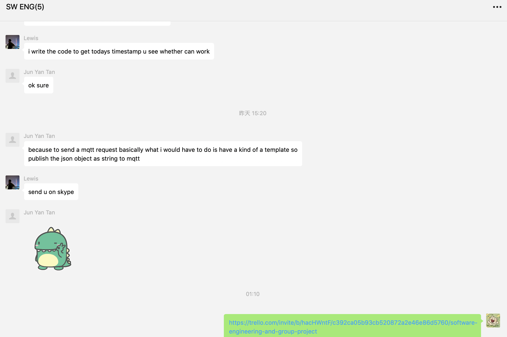
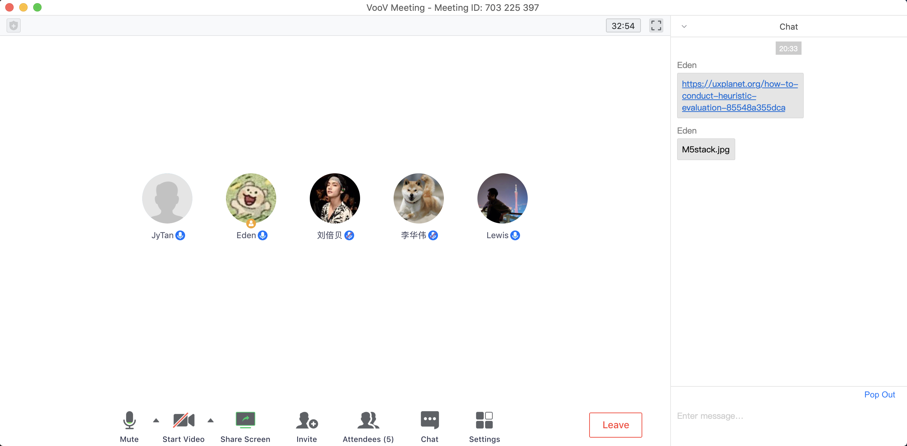
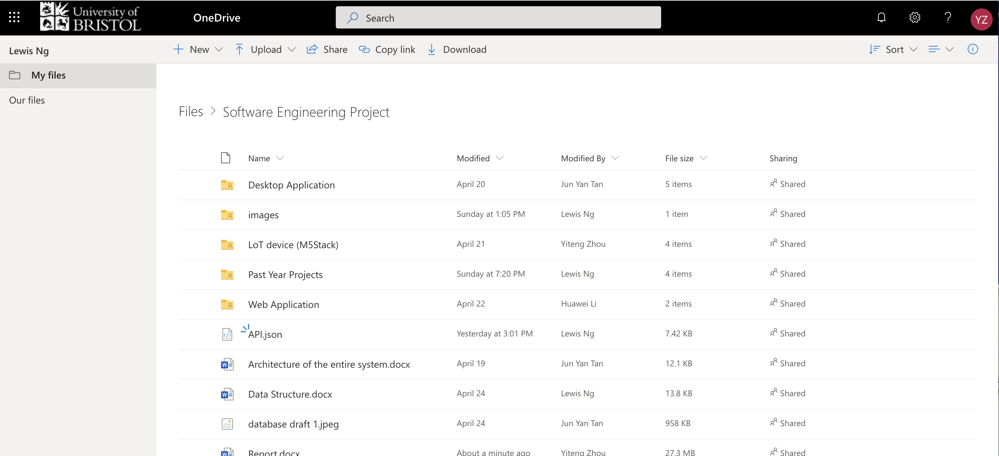
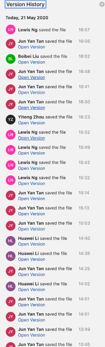
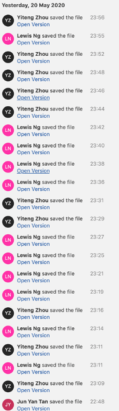
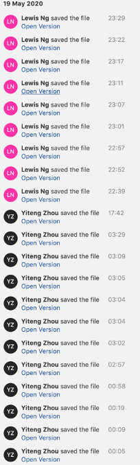
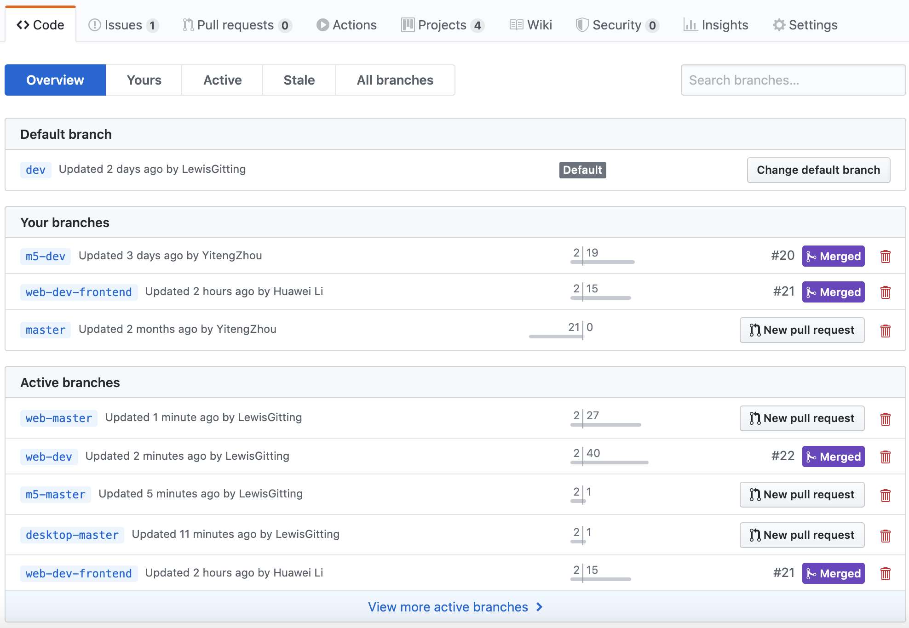

# Project Evaluation

- [**a. Reflective discussion of the success of the project**](#a.-Reflective-discussion-of-the-success-of-the-project)
  - [System Design](#System-Design)
  - [System Implementation](#System-Implementation)
- [**b. Discussion of future work**](#b.-Discussion-of-future-work)
  - [M5Stack Application](#M5Stack-Application)
  - [Desktop Application](#Desktop-Application)
  - [Web-Application](#Web-Application)
- [**c. Reflect on the working practices of your group**](#c.-Reflect-on-the-working-practices-of-your-group)
  - [Team Organisation](#Team-Organisation)
  - [Management of issues](#Management-of-issues)
  - [Communication](#Communication)
  - [Code Management](#Code-Management)
- [**d. How Coronavirus Has Affected Our Project**](#d.-How-Coronavirus-Has-Affected-Our-Project)

## a. Reflective discussion of the success of the project

### System Design

In terms of system design, the team felt it is a good system design after our evaluation detailed in the previous section. The system delivers according to the system requirements with our testing, and it is able to extend on functionalities easily. Each sub-system can also be substituted without affecting the other parts of the system with the “Separation-of-Concerns” and common “contract” in place. However, in terms of user interface design, we will require actual user testing to have a more accurate evaluation of them. 

### System Implementation

In terms of system implementation, the team felt that it is a very successful software engineering project. While we may not have implemented all the features we will like on the system, our approach to software development is very structured and transparent. By adhering to the Scrum practices, we drafted the product backlogs for each sub-system and the sprint backlogs for each sprint. Coupled with the Trello board organising the tasks in each sprint backlog into “To do”, “In Progress”, and “Done”, we can clearly see the progress of each member and what each member is working on at any given time. This also allows every member to be on the same page and it is easier to raise questions and issues. By Scrum standards, we also conducted daily meetings to discuss issues and do daily updates.

In terms of code management, we also felt it was a very successful run with few merge conflicts. This can be credited to our code management style in terms of branching, which will be discussed further in section 3c.

## b. Discussion of future work

We will talk about the future improvement in detail according to the different three subsystems.

### M5Stack Application

The M5stack as the core component of our product has great potential to bring greater benefits to users.

<b>More optimization in UI</b>

In the process of developing IoT device, although we have tried to make the final product as close to the UI wireframe possible with the time constraints, resulting in some of the features idealised in the brainstorming was not implemented. For future improvement we hope to have a more user-friendly interface through running product trial getting valuable feedback from users.

<b>Richer content</b>

The possible improvements on the M5stack are, for instance, the pet interactive systems can enhance fun and dependence, the friend communication system could form users circle and increase project influence, reminder and suggestion system could help users better plan their sports schedule.

<b>More effective evaluation</b>

In this project, although peer evaluation and heuristic are used, the user evaluation was not carried due to the ongoing pandeamic, which result in the lack of feedback on our IoT. Therefore, before the next sprint, we need to recruit participants to carry out the user evaluation.

<b>Safer data</b>

We discussed privacy and data protection issues in 2c section. In order to improve data security, all user data will be stored in an encrypted format as well as the possible transfer of devices. In addition, deletion of redundant data can be implemented to prevent stale data from being forgotten about and stolen at a later date.

<b>Better wear</b>

Our imagined this IoT device is portable and wearable during sports and daily work rather than temporary wearing this device for accumulating steps or training pets. Our initial testing review that the current device is very inconvenient due to its bulky nature of the M5Stack possibly hindering intensive activities . Hence, lighter devices may need to be considered, may be like a watch or a bracelet.

### Desktop Application

In terms of the desktop application, in addition to a platform for developer to analyse data as well as manage pets it has the potential to be expanded for users of this fitness eco-system make use of this application. 

<b>UI Design</b>

The current state of the desktop application although useable, the user-interface is not as astatically pleasing as we hoped. The future work for UI design would be the ability to change desktop background, customising the placement of elements within the desktop application such as the dropdown list, display pictures and also the ability to change types of data visualisation tools that the developer wishes to use. In conclusion we wish to add more customisation options for the user of the desktop application.

<b>Login support</b>

We also wish to add in login support to allow the desktop application to differentiate between admin user and a normal user assigning them with the correct privileges. This allow us to expand the platform to not only the developer as mentioned above. With this feature users can also customise their own pets to be checked and optimised by the developer before uploading it to the system to be used by another user. The option of designing a pet from scratch would definitely encourage the end-user to be more pro-active to show the pet to friends and family by climbing the leader board.
 
### Web Application
This web application has shown the potential as an account management terminal of M5Stack for users, it shows the ability to display users’ data collected by M5Stack in multi terminals including PC and mobile device due to the support of the modern web design. In the future, several features could be further developed:

<b>Optimized UI</b>

The current UI of web application is too simple and have a great potential to be improved. Adding some animation effect and transition effect in the GUI will make it more attractive for users.
Pet System Improvement: More entertainment functions relating to the pet system could be added, such as pet animation effect and interaction with pet. 

<b>Multi M5Stack Support</b>

Currently an account can only management data collected from one M5Stack. It will be more convenient for users with more than one M5Stack if we can extend this application to making it can maintain multi M5Stacks in one account. 

<b>AR Support with Map function</b>

AR (Augmented reality) games such as Ingress and Pokémon Go are one of the next generation electronic entertainment. We can implement the support to M5Stacks with AR functions in the future.
s

## c. Reflect on the working practices of your group

### Team Organisation

Because the members of our team have different advantages and interests, everyone was tasked with one responsibility or subsystem. In addition, each person is involved in system design and project sprints to ensure that everyone always understands what is happening and always keeps up to date with the project's skills and knowledge. These are particularly valuable in this difficult time. 

Beibei has extraordinary meticulousness and seriousness, and always been interested in art, so She is mainly responsible for system design, pets design and UI optimization. Yan is largely in charge of desktop application and statistical analysis because he is an expert in various software and has a mathematical background. Yiteng, who often has some novel ideas and strong programming ability, is in charge of the development of M5stack and visualization. Huawei, with powerful web development technology, is responsible for web application and communication work. Lewis, who was once responsible for company’s database project, is in charge of the database in this project and management of sprint processes.

Despite in this special period, our work keeps well organized and each member remains passionate about this project. This ensures that everyone is committed to and excited about this IoT device.

### Management of issues

At first, we managed issues or subsystem requirements was at GitHub, which can create, delete and manage various issues easily. During different sprints, team members can clearly see product backlogs and milestones with colored labels in GitHub. However, some members cannot use GitHub effectively due to their geographic location. Subsequently, we not only update on GitHub, but also in Trello, which has more powerful Todo-Doing-Done boards with tick and deadline.

While executing the agile sprints, the frequency of group members meetings from the original twice a week gradually changed to once a day. This is because many details need to be communicated in time that ensure our backlogs and sprints can be completed on time. For example, in the process of mutual communication between different subsystems, even a short halt hour (usually more than 1 hour) can greatly improve the progress and completeness of the project.

### Communication

Due to the outbreak of the coronavirus epidemic, the team members were separated in four different countries and endured by the time difference and internet problems. In order to effectively communicate and share information with each other, we decide to use the Tencent Meeting for discussing and the WeChat software for daily communication, as shown in the following two pictures.

<b>
Figure 1: Communication using the WeChat 
</b>

The WeChat mainly used for coordinating meetings, asking questions, seeking assistance and sharing resources. Actually, we tried other software, such as Slack and WhatsApp, but these will be blocked or hindered by mainland China’s policies. Hence, WeChat seems to be the most suitable choice without additional restrictions. So far it can meet all the communication requirements of developing this project.

<b>
Figure 2: Scrum meetings using The Tencent Meeting 
</b>

The Tencent Meeting is also used to scrum meetings, communicate with each other without delay and have a “face-to-face” discussion. We initially tried to use WeChat for video conferencing, but multi-person conference function of this software Is very unstable. So, we chose Tencent Meeting in the end. However, the time difference is inevitable. Hence, we usually hold meetings from 12pm to 17pm UK time (evening in East Asia and Southeast Asia) as no other time is more suitable. In general, the combination of the above two software can meet all our communication needs.

<b>
Figure 3: Share documents using OneDrive 
</b>

<b>
Figure 4: Edit documents together using OneDrive 
</b>

### Code Management

Firstly, the development of the codebase is split according to the sub-systems, mainly branches “m5-master”, “desktop-master”, and “web-master”. This serves as the main or master branches of the sub-systems. To simulate an actual development workflow, commits are only made to master branches on releases of the applications or urgent bug fixes. That is to say, commits on master branch are minimised and be made only after reaching certain checkpoints and have passed the testing phase. Thus, we will primarily work on development branches which are namely “m5-dev”, “desktop-dev”, and “web-dev”. For sub-system groups with a single developer, they will be working on committing on these branches. They will also be their own branch managers. However, for groups with multiple developers, they will be development on their own feature branch branched from the development branch. One member will act as the branch manager and be in charge of merging the code. The branch manager will consult the member who did the pull request to find out what implementations are and will check and resolve any merge conflicts. This is a better approach than multiple team members committing to the same branch, which can cause confusion and have one member unintentionally deleting another member’s code. Another advantage is that there will always be one member kept in the know of all the changes in the codebase and can serve as the point of contact for the other sub-systems. Example of these feature branches are “web-dev-frontend” and “web-dev-backend”, with the backend developer acting as the branch manager and merging changes. 

<b>
Figure 5: Share code and merge branch using The Github 
</b>

## d. How Coronavirus Has Affected Our Project
<b>Limited time</b>

Due to the dangerous situation in March, our students were busy dealing with all kinds of problems, such as getting tickets back home, forced quarantine policy taken by their countries, preparing for essentials and so on, for a long period of time our plan had to be paused, which greatly messed up our original plan. After then we had to discuss about new solutions to make up for it, thus leading to less efficient time to work on the project. 

<b>Environment instability</b>

The complicated and unstable COVID-19 has caused our members plenty of anxiety as some of us are staying in areas where the situation is very serious, which affected our condition both physically and mentally so much that we cannot really focused on our own work well for a few weeks.

<b>Remote Working Practices</b>

Because of the social distance policy we had to transfer our work to online, and what’s worse, our group members are apart in four different countries. The biggest obstacle is the time difference, due to this factor sometimes our communication is not very sufficient. And remote working is definitely no better than normal teaching arrangement. One thing is that we previously planned some off-line user testing process, which had to be changed afterwards. What’s more, the learning experience and outcome has more or less been affected due to the lack of studying environment and resources. 

<b>Pressure from other modules</b>

Besides this software engineering group project, we still got many other coursework from other modules to finish, and all of them are very challenging, and the due time are all very intensive. Although the Uni kindly offer us no detriment policies as well as considerate extension time, because we cannot keep the same working outcome as before, the pressure is still rather heavy.

<b>Fewer contributors</b>

One of our group members suspended study because of the current unstable situation. Although she still tried best to make contribution due to the sense of responsibility, as she got her own issues and plans to deal with, her effort are rather limited than we planned at the very beginning. So the workload for the rest of the members has increased.
