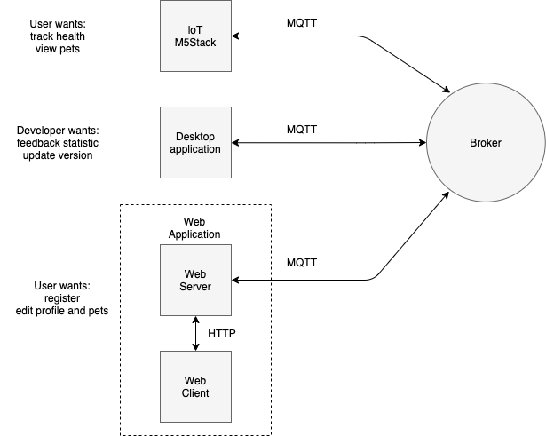
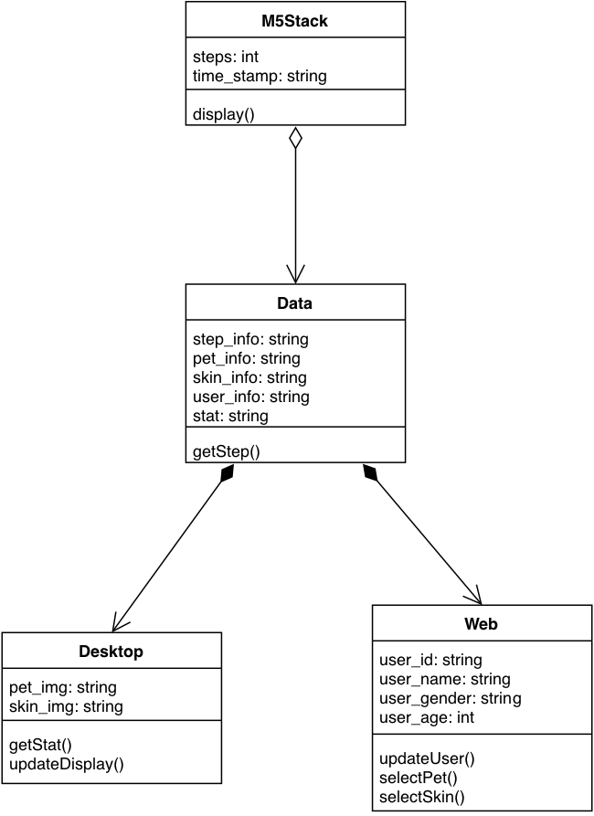
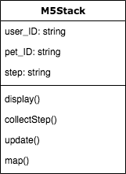

# System Design

## Architecture of the system

Overview: We are working on a health fitness tracker that comprises of a virtual pet interface in addition to the basics fitness tracker functionality to encourage end-user to be more pro-active.  

The M5 stack will be a wearable device where the user can strap it to his or her wrist or ankle that provides other platform (web application and desktop application) with relevant information. In addition to providing steps, it also displays statistics such as the virtual pet avatar, pet name, pet level, experience points, total steps taken (today), total steps take (weekly) and some health feedbacks to encourage user to be more pro-active. 

The desktop application will be a platform that allow developer to have the ability to upload, view and edit the virtual pet photo as well as its equipment. It also processes information from the M5 stacks generating statistics such as cumulative steps (daily), cumulative steps (weekly) and average steps daily based on cumulative weekly steps. The UI for the desktop application display health-oriented graphs and usage statics. 

The Web application allows for the registration of new user, information such as username, gender, age and other relevant information can be added to the user profile. It also allows for the ability to choose the type of pet or equipment the user wishes to display.

#### System Architecture

## Object-Oriented design of key sub-systems

### M5Stack Application

The main function of M5Stack in this project is to display user’s health statistics and pet information, record and upload user’s physical steps, update data from desktop and web application (loT interacts with web application and desktop application).

#### UML diagram

### Desktop Application

#### UML diagram

### Web Application

## Requirements of key sub-systems

### M5Stack Application
IoT device (M5Stack) is designed for registered users, who could wear this device to tracker their physical steps, view health report and interact with virtual pets. There are two principal features of the loT device:  

The first feature is to display user information and virtual pet information. The former includes user profiles, and daily or weekly health performance (steps, calorie count, etc). The latter includes virtual pet status, such as avatar, name, gender, age, level, etc. Each user and virtual pet have a unique ID to store, transfer and recall data conveniently. Besides, in the user information section, contacts and challenge modes are created. Users can view the step rankings of friends and challenge them. The challenge is usually to compare the next day’s sports behavior, and the winner can unlock more virtual pet model and skin.   

The second feature is to track user steps and record health activities. The user’s steps/per minute and paths are obtained by counters and sensors built into the device. These obtained data are uploaded to the server and processed by the developer as a health report and then can be viewed in the first function. 

| User Story ID |                                                                             User Story                                                                            |  Backlog Items | Sub-system | priority |
|:-------------:|:-----------------------------------------------------------------------------------------------------------------------------------------------------------------:|:--------------:|:----------:|:--------:|
|       1       | As a user who wants to make his body healthier, I want to view my walking and running activity so that I can lead a well-balanced life between fitness and health |  Health report |   M5Stack  |          |
|       2       |                        As a lover of fitness, I want to track my steps and calories so that I can plan sport and exercise more efficiently.                       |   Track steps  |   M5Stack  |          |
|       3       |                           As a user who wants to make his life more interesting, I want to enjoy interacting with my virtual pet so that                          |   Virtual pet  |   M5Stack  |          |
|       4       |                          As a user, I want to be able to log into my account on the M5Stack so that and I can count steps for my sports.                          |   Log system   |   M5Stack  |          |
|       5       |   As a loT user, I want to visualize my health reports and lovely digital pet on my device, so that I can check my fitness data and pets at any time to review.   | Display system |   M5Stack  |          |
|       6       |   As a user whose friends also use same device, I want to rank and challenge with my friends, so that I can interact with my friends and do fitness more active.  |  Friend system |   M5Stack  |          |
|       7       |                       As a user, I want to check map and track walking or running movement so that I can record traces of my movement on map                      |   Map system   |   M5Stack  |          |
|       8       |                                                                                ...                                                                                |                |            |          |

### Desktop Application

The desktop application is designed for developer/ administrator to manage certain features of the VitualPet system. There are two main parts of the desktop application: 

For the first part, the developer can add new pets or skins as well as make change on existing pets or skins such as adding new types of pet or skin. 

For the second part, the developer can monitor user statistics. A search can be performed by username to access the specific user profile page, where basis information as well as health statistics such as such as the daily steps and weekly steps taken by a user are displayed.  

The health statistics such as daily steps can be displayed in a form of vertical bar chart where the bars are denoted by the hours of the day (e.g. 00:00, 01:00), similarly the weekly graph can be display in the same fasion where the bars denote each day of the week (e.g. Mon, Tue), making it easier for the developer to get some health feedback to the user. 

| User Story ID |                                                                        User Story                                                                        |         Backlog Items        |      Sub-system     | priority |
|:-------------:|:--------------------------------------------------------------------------------------------------------------------------------------------------------:|:----------------------------:|:-------------------:|:--------:|
|       1       |                  As a developer, I want to be able to view user’s profile so that I can have a better understanding of my user’s usage.                  |       User Information       | Desktop Application |          |
|       2       |              As a developer, I want to be able to get statistics about the specific user, so I can tailor specific health feedback to them.              |        User statistics       | Desktop Application |          |
|       3       |          As a developer, I want to be able to have a visual representation of my user usage, so that I can have a better understanding visually.         |       Visual Statistics      | Desktop Application |          |
|       4       |           As a developer, I want to be able to upload, view and edit the pet and skin database, so that capture user interest with new content.          | Manage pet and skin database | Desktop Application |          |
|       5       | As a developer, I want to be able to view all the changes made on the desktop application, so that I can revert to previous state if a bug was produced. |        Logging System        | Desktop Application |          |
|       6       |                                                                            ...                                                                           |                              |                     |          |

### Web Application

The web application is designed for pc/mobile users to register account and connect the M5Stack to their account. After registration they also can check and edit the detail information of their account and virtual pet in the web application. 

The first feature for users is to register their account. A user of M5stack can create an account with profile in the web application and connect their M5stack to their account by input the machine code of the M5Stack into the web application. After that the data between M5Stack and web application will be synchronously updated.  

The second feature is that users can check and edit their profile and pet information. It can illustrate much more detailed information than M5Stack as it is displayed on a larger screen. The main information for user to check includes username, gender, age, steps per day (in form of chart and table), friends, pet name, pet status and unlocked equipment for pet.  

The web application is also designed as a reactive website, which means it can be correctly displayed in any kinds of network devices including pc/tablet/phone.  

## Evolution of UI wireframes for key sub-systems

### M5Stack Application

### Desktop Application

### Web Application

## Details of the communication protocols in use

The communication protocol used by the M5Stack application is the Message Queuing Telemetry Transport (MQTT) protocol. MQTT is a lightweight messaging protocol that allows data transmission with low usage of network bandwidth and device resources. For Internet of Things (IoT) devices, the more commonly used communication protocols include MQTT, Advanced Message Queuing Protocol (AMQP), Constrained Application Protocol (CoAP), and Extensible Messaging and Presence Protocol (XMPP). MQTT is chosen over the others due to the ease of setup, lower bandwidth usage and battery consumption, and better suitability for event-based implementation. MQTT also takes a publish-subscribe pattern, where the clients will subscribe to channels hosted by a message broker and be able to send and receive messages over the subscribed channels. This is especially helpful as clients can easily communicate with one another with little setup and procedures can be triggered upon receipt of messages. An alternate approach will be to use the HyperText Transfer Protocol (HTTP) with WebSockets. However, MQTT is once again chosen due to the lower bandwidth and battery usage, faster throughput, and higher delivery guarantees. 

The communication protocol used by the web application is HTTP and MQTT, since the client of the web application communicates with the server using HTTP and the server has to communicate with the other applications using MQTT. The communication protocol used by the desktop application is MQTT for the same reason. 

## Details of the data persistence mechanisms in use

The data persistence mechanism used for the system will be an embedded database system. An embedded database system is chosen over a served database system (i.e. an additional database server) due to the reduced network and resource overhead and the ease of setup. In addition, an embedded database is more than sufficient for the scale of the project. A relational database is chosen in this case, since there are relationships to be defined between the entities of the system and it will be easier to maintain consistency in the data as such. The embedded database will be integrated with the web application, and the library used for the embedded database is SQLite. It is chosen as it is lightweight and it is the most widely used database engine. 

## Details of web technologies in use

### Web client 

The basic programming language in our web client are HTML5, CSS3 and Typescript. A famous front-end framework Vue.js and a CSS extension Less are also introduced in this project to implement a modern self-adaptation webpage design. This website is also designed as a single page application, thus the front-end router implemented in Vue is used.  

Vue.js is a MIT open source front-end framework designed for reactive website development. This framework is chosen in our project mainly based on following rational: Firstly, comparing with Angular and React, it has a less steep learning curve so that the project can be started up without too much preparation. Secondly, Vue is quite suitable for a lightweight application development just like this project, while Angular is designed for a much more complex development and most of its functions are redundant for our project.  

### Web server 

Our web server is developed using Node.js. Node.js is designed for developing a scalable network application. The rational for choosing this framework is that the web server in our project is not complex and Node.js is capable for dealing with it, as well as the Node.js is much more swift and easy to use in comparison of Java based framework such as Spring.  
