# System Design

## Design thinking

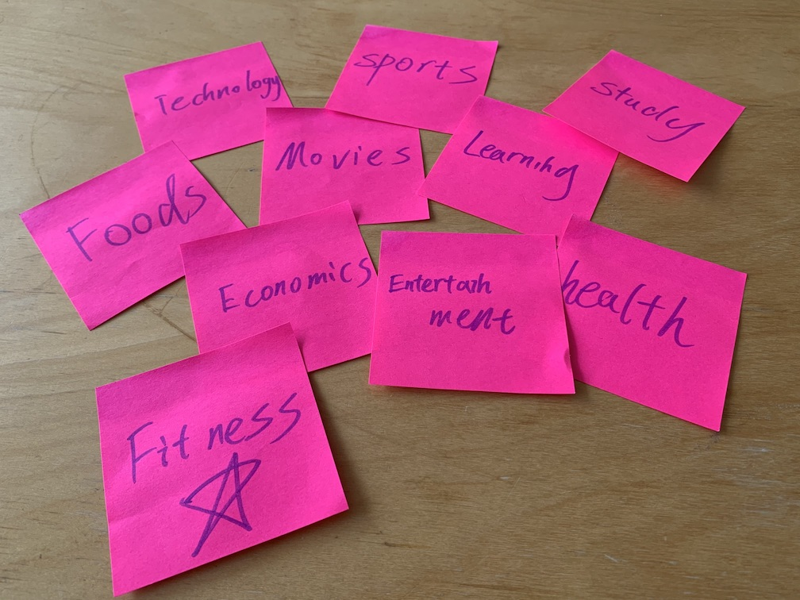

<b>
Figure 1: Brainstorming during design thinking
</b>

We started the project by brainstorming some ideas for an innovative internet-enabled product that will span Desktop, Web and Internet of Things devices. Some of the initial ideas were really rough such as, academics, health, entertainment, sports and fitness as seen in the post-it notes in figure 1. We concluded that fitness aspect was what we are all interested in and would starting brainstorming on a product that will span all three aspects.

## Architecture of the system

Overview: We are working on a health fitness tracker that comprises of a virtual pet in addition to the basics fitness tracker functionality to encourage end-user to be pro-active.  The system architecture will encompass three different elements namely M5Stack, desktop application and a web application. Instead of developing a mechanism for data persistence in each of the systems, we decide that having an API server which stores and process data from all the different systems will simply the JSON object that has to be passed around for this application to be feasible. In the next few sections, we will be dive into each of the elements at a greater dept discussing their applications.

### System workflow

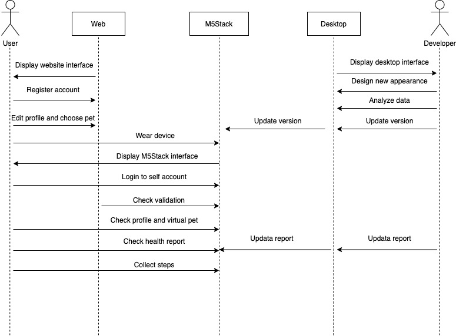

<b>
Figure 2: Sequence diagram for Jungle Fitness
</b>

### M5Stack

The M5Stack will be a wearable device where the user can strap it to his or her wrist or ankle provide other platform (web application and desktop application) with relevant information such as steps. In addition, statistics such as the virtual pet avatar, pet name, pet level, experience points, total steps taken (today), total steps take (weekly) and some health feedbacks can also be displayed to encourage user to be more pro-active.

The functions of our M5Stack includes:
* Display simple UI interface on M5Stack device, including personal information, virtual pet information, collecting steps, menu, map system, friend system, login system, etc.
* Collect steps per hour using the build-in pedometer
* Receive JSON information (user, pet and status message) from MQTT
* Response to web and desktop application via MQTT
* Send specific steps and time JSON message to MQTT
* Control various UI interface using M5Stack button
* Track user distance and location by build-in GPS

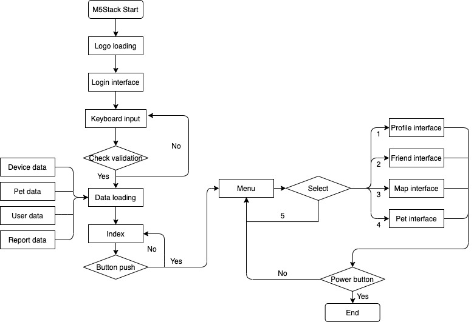

<b>
Figure 3: The workflow of M5stack
</b>

### Desktop Application
The desktop application will act as an interface to allow developer to have the ability to upload, view and edit the virtual pet photo as well as its equipment. For data visualisation, API request will be made to our API server and receive data in the form of JSON oobject via MQTT which will be discussed in greater dept in section on communication protocol. It processes information from the M5Stack generating statistics such as cumulative steps (daily), cumulative steps (weekly) and average steps daily based on cumulative weekly steps. 
Some of the feature of our desktop applications includes:
* General data visualization of each user’s activity displayed through bar chart, pie chart, etc.
* A search to search for specific user.
* A dropdown list that includes all the users registered in the database.
* A user-friendly user interface for the maintenance of new pet, skin, etc.

### Web Application
The Web application enable registration of new user. The required information for new users is username, gender, age and other relevant information will be added to the user profile. The web application also allows the user to choose the desired pet and equipment to be displayed on their profile.
The web application contains following components:
* Index page: Entry of the web application
* Register page: create account with user id and password
* Log in page: log in account with user id and password
* User page: Display user information
* Pet page: Display pet information
* Router components: A frontend router to navigate to all pages
* Store components: Store all states used in web application

### System Architecture

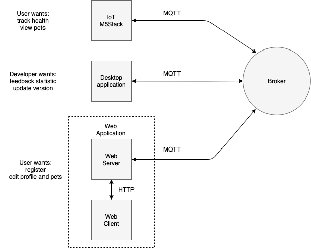

<b>
Figure 4: The workflow of M5stack
</b>

With the requirements from each sub-system and following the principles of managing technical debt, the system architecture is designed as shown. In order to store user account details and their pet details, a data store is required. The data store takes the form of an embedded database served by the server. This fulfills the principle of “Separation-of-Concerns" (SoC) as the data is stored in a separate repository and we can modify the codebase of each sub-system without affecting dependencies. The principles of least surprise and least effort are also fulfilled since we are not introducing another database server and reducing setup overhead by using an embedded database. 

The server that will be serving the data to the different sub-systems will be the web server. This means that the web server will be acting as an API server in addition to serving web pages. The web client will communicate with the server via HTTP, in the form of RESTful HTTP APIs. The M5Stack and desktop applications will communicate with the server via MQTT, through a message broker. A standardised JSON object format is used for MQTT communication to ensure that subscribers on the same topic will be able to distinguish the sender and recipient as well as the API call. Details of the API design will be discussed under section 1e. This fulfills the “Liskov Substitution Principle” where the standardised request and response JSON objects serve as a common “contract” between the different sub-systems, which allows for substitution of the sub-systems. Lastly, the database is designed considering the foreseeable enhancements and normalised to BCNF form. This fulfills the “Open-Closed” principle where we allow for functional extensions to the various sub-systems.

## Object-Oriented design of key sub-systems

### M5Stack

The main function of M5Stack in this project is to display user’s health statistics and pet information, record and upload user’s physical steps, receive and send information to desktop and web application via MQTT. Classes UML diagram shows the object-oriented design of M5Stack as following figure.

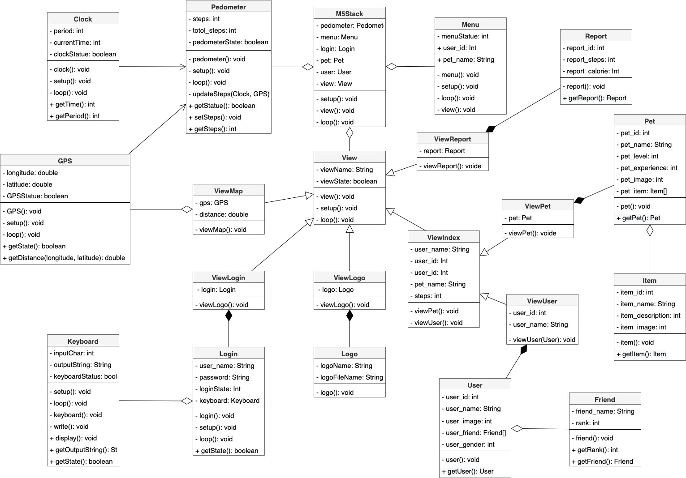

<b>
Figure 5: UML diagram to show the relationships between classes in the M5Stack
</b>

* The M5Stack (main) class is the most important component in the whole system. It creates private classes to control and store data, such as Pedometer for collecting steps, Pet and User for storing data, View for showing interface on the screen. Besides, it also contains the method setup(), loop() for the continuous update of the device, and view() to display the UI interface.  
* The Pedometer class is mainly used to collect user steps timely (record steps per hour). It contains two private classes, Clock and GPS, to handle the problems of distance, steps, and time. Also, a Boolean variable to check pedometer status. The method updateSteps(Clock, GPS) update user steps every hour and then send the message to MQTT.  
* The Clock and GPS classes that contain different variables and method. The former record time and location for the Pedometer class. The latter serves the ViewMap class to build the map system. 
* The View class is yet another critical component in the M5stack system. It is extended by various classes, including ViewIndex, ViewLogo, ViewReport, ViewMap, ViewLogin. Among them, the ViewIndex is also extended by ViewPet and ViewUser. These classes build the M5stack interface system. 
* The ViewLogin, Login and Keyboard classes build-up the login system. ViewLogin class is used to display a login view and keyboard on the screen. Login class stores username, password, and machine code and send this information to MQTT for validation. The Keyboard class is used to display an onscreen keyboard similar to those on a smartphone.
* The ViewLogo, Logo classes allows for the display of dynamic picture, such as our logo.
* The ViewReport, Report classes stores the report data and show the user’s health report. 
* The ViewPet, Pet classes stores virtual pet data and show user’s pet. 
* The ViewUser, User classes stores user data and show user’s information. 
* The Menu classes stores current status and show the menu. 
* The User class store all user’s information, such as user_id, user_name, user_image, user_gender, etc. In addition, this class also contains an array of user’s friends, Friend[], to record the user’s friend for interacting with each friend. 
* The Pet class store all user’s pet information, such as pet_id, pet_name, pet_level, pet_experience, etc. In addition, the Pet class also contains an array of pet items, item[], to record all equipment and skins decorate on this pet. 
* The Friend and Item classes store basic information of corresponding items.

### Desktop Application

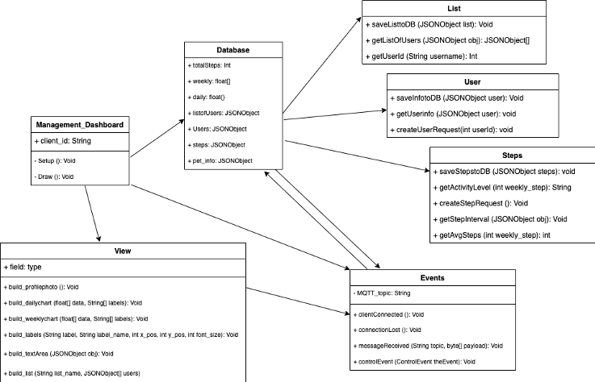

<b>
Figure 6: UML diagram to show relationship between classes within the desktop application
</b>

The main classes for the desktop application are:
* Database – This is a public class that can be accessed anywhere within the program, this includes strings and JSON object that will be used throughout the application. It deals with the storage of external data such as those from MQTT to be stored locally to be read and written by other methods within the application.
* Event – This class mainly deal with the communication with MQTT, it listens for incoming message in the form of a string. The string can then be parsed using a JSON object parser built into java to convert it into a JSON object. Based on the JSON object types, different actions can be performed such as saving data into database, requesting of data by publishing JSONObject to MQTT and the refresh of dashboard information. This class also contain event listener such as the interaction with the dropdown list, buttons and carry out the respective actions.
* View – This class deals with the data visualization done through methods such as the building of dropdown list, building of text area, building of title, etc. The method uses API from the data class as well as data from the database class. It also contains method that deals with the refreshing of data when interacting with elements of the dashboard.

### Web Application

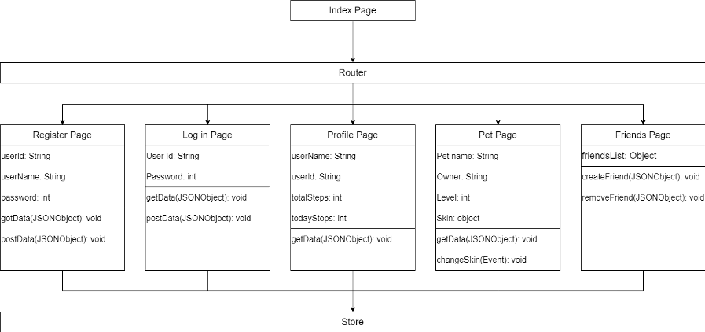

<b>
Figure 7: UML diagram to show the relationship between components in the web application
</b>

The main components for the web application are: 
* Index Page - This is the main vue component and acts as an index for the entire web application. It allows for the navigation to register page, login page, profile page, pet page, friend page and map page by router. 
* Router – This is a front-end router implemented by Vue Router. It helps to build a single page application and controls the navigation between all vue components. 
* Register component – A vue component which is used to create account with user id and password. 
* Login component – A vue component used to log in account with user id and password
* Profile component – A vue component used to display user information. An Echart external library was introduced for the implementation steps statistics display. 
* Pet component – A vue component used to display pet information
* Friends component – A vue component used for management of friends. 
* Map component - A vue component used to display user’s daily route. 
* Store – This is a store to manage all the states of every components in this web application. It contains two objects: the state object, which stores all the states used by other components, and the mutated object, which is the only way to change the values in the state object.

## Requirements of key sub-systems

### M5Stack Application
M5Stack is designed for registered users, who could wear this device to tracker their physical steps, view health report and interact with virtual pets. The two main features of this loT device are: 

To display user information and virtual pet information. The former includes user profiles, and daily or weekly health performance (steps, calorie count, etc). The latter includes virtual pet status, such as avatar, name, gender, age, level, etc. Each user and virtual pet have a unique ID to store, transfer and recall data conveniently. Besides, in the user information section, contacts and challenge modes are created. Users can view the step rankings of friends and issue challenges. The challenge is in the form of a competition between players to get more steps in a single day, and the winner can unlock more virtual pet model and skin. 

The second feature is to track user steps and record health activities. The user’s steps/per minute and paths are obtained by counters and sensors built into the device. These obtained data are uploaded to the server and processed by the developer as a health report and then can be viewed in the first function.

| User Story ID |                                                                             User Story                                                                            |  Backlog Items | Sub-system | priority |
|:-------------:|:-----------------------------------------------------------------------------------------------------------------------------------------------------------------:|:--------------:|:----------:|:--------:|
|       1       | As a user who wants to make his body healthier, I want to view my walking and running activity so that I can lead a well-balanced life between fitness and health |  Health report |   M5Stack  |          |
|       2       |                        As a lover of fitness, I want to track my steps and calories so that I can plan sport and exercise more efficiently.                       |   Track steps  |   M5Stack  |          |
|       3       |                           As a user who wants to make his life more interesting, I want to enjoy interacting with my virtual pet so that                          |   Virtual pet  |   M5Stack  |          |
|       4       |                          As a user, I want to be able to log into my account on the M5Stack so that and I can count steps for my sports.                          |   Log system   |   M5Stack  |          |
|       5       |   As a loT user, I want to visualize my health reports and lovely digital pet on my device, so that I can check my fitness data and pets at any time to review.   | Display system |   M5Stack  |          |
|       6       |   As a user whose friends also use same device, I want to rank and challenge with my friends, so that I can interact with my friends and do fitness more active.  |  Friend system |   M5Stack  |          |
|       7       |                       As a user, I want to check map and track walking or running movement so that I can record traces of my movement on map                      |   Map system   |   M5Stack  |          |
|       8       |                                                                                ...                                                                                |                |            |          |

### Desktop Application

The desktop application is designed for developer/ administrator to manage certain features of the VitualPet system. There are two main parts of the desktop application: 

For the first part, the developer can add new pets or skins as well as make change on existing pets or skins such as adding new types of pet or skin. 

For the second part, the developer can monitor user statistics. A search can be performed by username to access the specific user profile page, where basis information as well as health statistics such as such as the daily steps and weekly steps taken by a user are displayed.  

The health statistics such as daily steps can be displayed in a form of vertical bar chart where the bars are denoted by the hours of the day (e.g. 00:00, 01:00), similarly the weekly graph can be display in the same fasion where the bars denote each day of the week (e.g. Mon, Tue), making it easier for the developer to get some health feedback to the user. 

| User Story ID |                                                                        User Story                                                                        |         Backlog Items        |      Sub-system     | priority |
|:-------------:|:--------------------------------------------------------------------------------------------------------------------------------------------------------:|:----------------------------:|:-------------------:|:--------:|
|       1       |                  As a developer, I want to be able to view user’s profile so that I can have a better understanding of my user’s usage.                  |       User Information       | Desktop Application |          |
|       2       |              As a developer, I want to be able to get statistics about the specific user, so I can tailor specific health feedback to them.              |        User statistics       | Desktop Application |          |
|       3       |          As a developer, I want to be able to have a visual representation of my user usage, so that I can have a better understanding visually.         |       Visual Statistics      | Desktop Application |          |
|       4       |           As a developer, I want to be able to upload, view and edit the pet and skin database, so that capture user interest with new content.          | Manage pet and skin database | Desktop Application |          |
|       5       | As a developer, I want to be able to view all the changes made on the desktop application, so that I can revert to previous state if a bug was produced. |        Logging System        | Desktop Application |          |
|       6       |                                                                            ...                                                                           |                              |                     |          |

### Web Application

The web application is designed for pc/mobile users to register account and connect the M5Stack to their account. After registration they also can check and edit the detail information of their account and virtual pet in the web application. 

The first feature for users is to register their account. A user of M5stack can create an account with profile in the web application and connect their M5stack to their account by input the machine code of the M5Stack into the web application. After that the data between M5Stack and web application will be synchronously updated.  

The second feature is that users can check and edit their profile and pet information. It can illustrate much more detailed information than M5Stack as it is displayed on a larger screen. The main information for user to check includes username, gender, age, steps per day (in form of chart and table), friends, pet name, pet status and unlocked equipment for pet.  

The web application is also designed as a reactive website, which means it can be correctly displayed in any kinds of network devices including pc/tablet/phone.  

## Evolution of UI wireframes for key sub-systems

### M5Stack Application

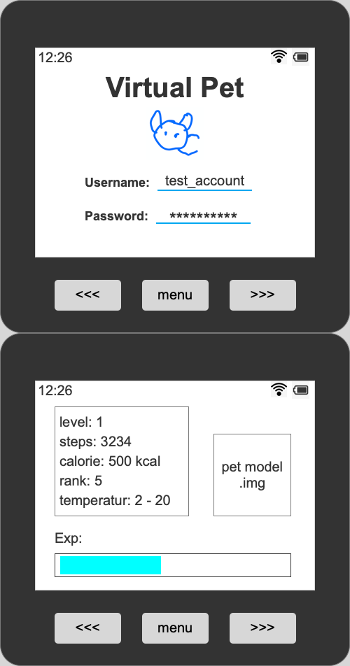

### Desktop Application

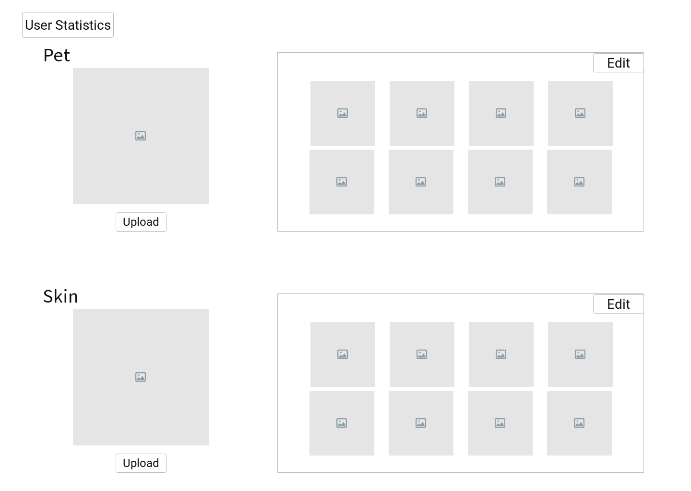

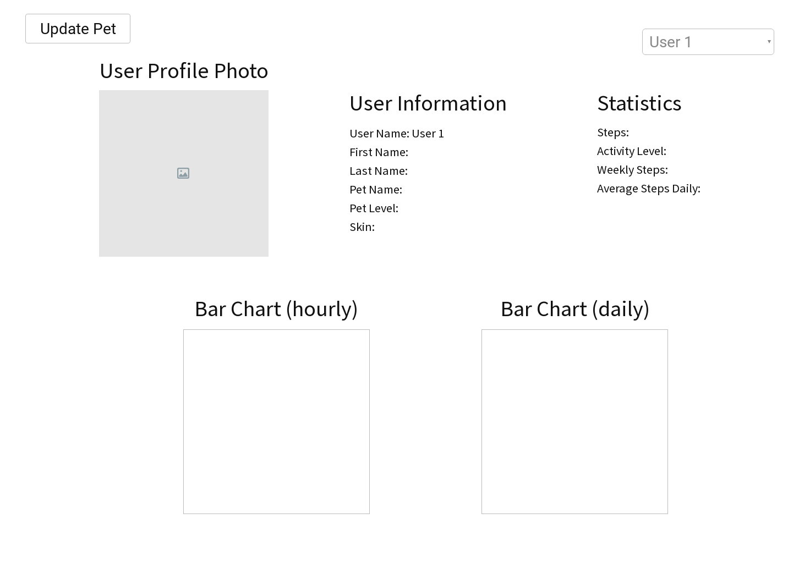

### Web Application

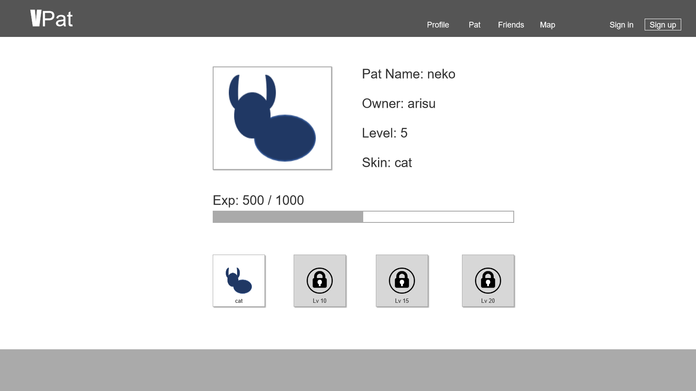

## Details of the communication protocols in use

The communication protocol used by the M5Stack application is the Message Queuing Telemetry Transport (MQTT) protocol. MQTT is a lightweight messaging protocol that allows data transmission with low usage of network bandwidth and device resources. For Internet of Things (IoT) devices, the more commonly used communication protocols include MQTT, Advanced Message Queuing Protocol (AMQP), Constrained Application Protocol (CoAP), and Extensible Messaging and Presence Protocol (XMPP). MQTT is chosen over the others due to the ease of setup, lower bandwidth usage and battery consumption, and better suitability for event-based implementation. MQTT also takes a publish-subscribe pattern, where the clients will subscribe to channels hosted by a message broker and be able to send and receive messages over the subscribed channels. This is especially helpful as clients can easily communicate with one another with little setup and procedures can be triggered upon receipt of messages. An alternate approach will be to use the HyperText Transfer Protocol (HTTP) with WebSockets. However, MQTT is once again chosen due to the lower bandwidth and battery usage, faster throughput, and higher delivery guarantees. 

The communication protocol used by the web application is HTTP and MQTT, since the client of the web application communicates with the server using HTTP and the server has to communicate with the other applications using MQTT. The communication protocol used by the desktop application is MQTT for the same reason. 

## Details of the data persistence mechanisms in use

The data persistence mechanism used for the system will be an embedded database system. An embedded database system is chosen over a served database system (i.e. an additional database server) due to the reduced network and resource overhead and the ease of setup. In addition, an embedded database is more than sufficient for the scale of the project. A relational database is chosen in this case, since there are relationships to be defined between the entities of the system and it will be easier to maintain consistency in the data as such. The embedded database will be integrated with the web application, and the library used for the embedded database is SQLite. It is chosen as it is lightweight and it is the most widely used database engine. 

## Details of web technologies in use

### Web client 

The basic programming language in our web client are HTML5, CSS3 and Typescript. A famous front-end framework Vue.js and a CSS extension Less are also introduced in this project to implement a modern self-adaptation webpage design. This website is also designed as a single page application, thus the front-end router implemented in Vue is used.  

Vue.js is a MIT open source front-end framework designed for reactive website development. This framework is chosen in our project mainly based on following rational: Firstly, comparing with Angular and React, it has a less steep learning curve so that the project can be started up without too much preparation. Secondly, Vue is quite suitable for a lightweight application development just like this project, while Angular is designed for a much more complex development and most of its functions are redundant for our project.  

### Web server 

Our web server is developed using Node.js. Node.js is designed for developing a scalable network application. The rational for choosing this framework is that the web server in our project is not complex and Node.js is capable for dealing with it, as well as the Node.js is much more swift and easy to use in comparison of Java based framework such as Spring.  
