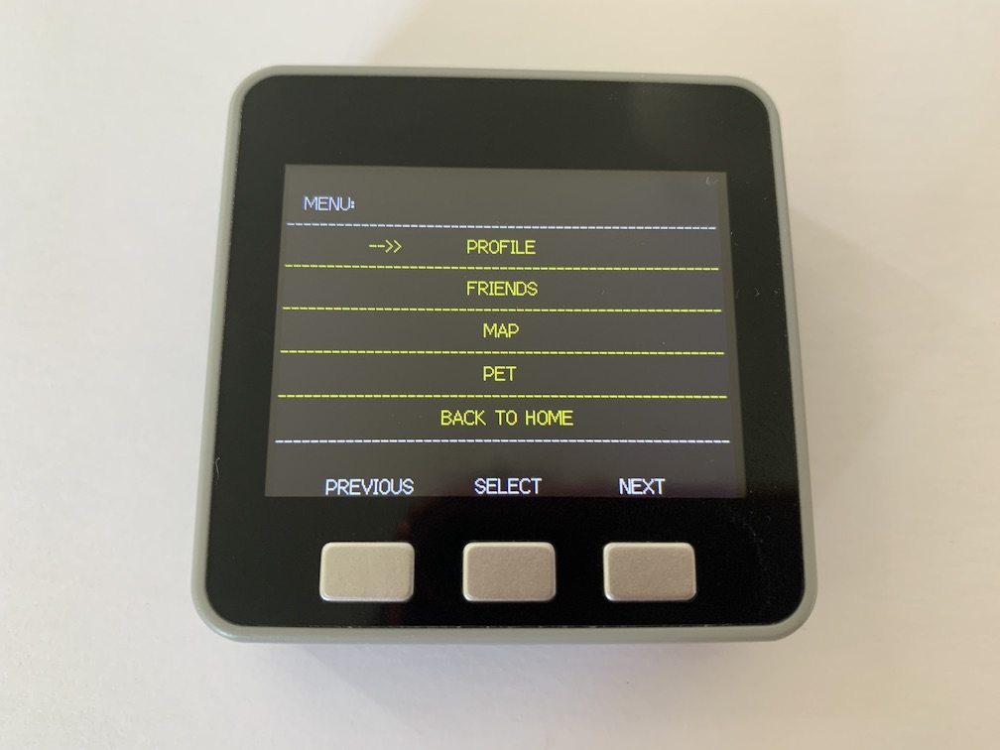

# 1. System Design

## Design thinking

<p align="center">

</p>
<b><p align= "center">Figure 1: Brainstorming during design thinking</p></b>

We started the project by brainstorming some ideas for an innovative internet-enabled product that will span Desktop, Web and Internet of Things devices. Some of the initial ideas were really rough such as, academics, health, entertainment, sports and fitness as seen in the post-it notes in figure 1. We concluded that fitness aspect was what we are all interested in and would starting brainstorming on a product that will span all three aspects. Following that, we decided that our problem area will be to encourage people to maintain an active lifestyle by walking or running regularly. Our stakeholders will therefore be people who are interested to maintaining an active lifestyle, hereafter known as the users, and the developers or administrators of the product. We will go on to draft product requirements based on this objective and the two groups of stakeholders.

## a. Architecture of the system

Overview: We are working on a health fitness tracker that comprises of a virtual pet in addition to the basics fitness tracker functionality to encourage end-user to be pro-active.  The system architecture will encompass three different elements namely M5Stack, desktop application and a web application. Instead of developing a mechanism for data persistence in each of the systems, we decide that having an API server which stores and process data from all the different systems will simply the JSON object that has to be passed around for this application to be feasible. In the next few sections, we will be dive into each of the elements at a greater dept discussing their applications.

### System workflow

<p align="center">

</p>
<b><p align= "center">Figure 2: Sequence diagram for Jungle Fitness</p></b>

### M5Stack

The M5Stack will be a wearable device where the user can strap it to his or her wrist or ankle provide other platform (web application and desktop application) with relevant information such as steps. In addition, statistics such as the virtual pet avatar, pet name, pet level, experience points, total steps taken (today), total steps take (weekly) and some health feedbacks can also be displayed to encourage user to be more pro-active.

The functions of our M5Stack includes:
* Display simple UI interface on M5Stack device, including personal information, virtual pet information, collecting steps, menu, map system, friend system, login system, etc.
* Collect steps per hour using the build-in pedometer
* Receive JSON information (user, pet and status message) from MQTT
* Response to web and desktop application via MQTT
* Send specific steps and time JSON message to MQTT
* Control various UI interface using M5Stack button
* Track user distance and location by build-in GPS

<p align="center">

</p>
<b><p align= "center">Figure 3: The workflow of M5stack</p></b>

### Desktop Application
The desktop application will act as an interface to allow developer to have the ability to upload, view and edit the virtual pet photo as well as its equipment. For data visualisation, API request will be made to our API server and receive data in the form of JSON oobject via MQTT which will be discussed in greater dept in section on communication protocol. It processes information from the M5Stack generating statistics such as cumulative steps (daily), cumulative steps (weekly) and average steps daily based on cumulative weekly steps. 
Some of the feature of our desktop applications includes:
* General data visualization of each user’s activity displayed through bar chart, pie chart, etc.
* A search to search for specific user.
* A dropdown list that includes all the users registered in the database.
* A user-friendly user interface for the maintenance of new pet, skin, etc.

### Web Application
The Web application enable registration of new user. The required information for new users is username, gender, age and other relevant information will be added to the user profile. The web application also allows the user to choose the desired pet and equipment to be displayed on their profile.
The web application contains following components:
* Index page: Entry of the web application
* Register page: create account with user id and password
* Log in page: log in account with user id and password
* User page: Display user information
* Pet page: Display pet information
* Router components: A frontend router to navigate to all pages
* Store components: Store all states used in web application


### System Architecture

<p align="center">

</p>
<b><p align= "center">Figure 4: The workflow of M5stack</p></b>

With the requirements from each sub-system and following the principles of managing technical debt, the system architecture is designed as shown. In order to store user account details and their pet details, a data store is required. The data store takes the form of an embedded database served by the server. This fulfills the principle of “Separation-of-Concerns" (SoC) as the data is stored in a separate repository and we can modify the codebase of each sub-system without affecting dependencies. The principles of least surprise and least effort are also fulfilled since we are not introducing another database server and reducing setup overhead by using an embedded database. 

The server that will be serving the data to the different sub-systems will be the web server. This means that the web server will be acting as an API server in addition to serving web pages. The web client will communicate with the server via HTTP, in the form of RESTful HTTP APIs. The M5Stack and desktop applications will communicate with the server via MQTT, through a message broker. A standardised JSON object format is used for MQTT communication to ensure that subscribers on the same topic will be able to distinguish the sender and recipient as well as the API call. Details of the API design will be discussed under section 1e. This fulfills the “Liskov Substitution Principle” where the standardised request and response JSON objects serve as a common “contract” between the different sub-systems, which allows for substitution of the sub-systems. Lastly, the database is designed considering the foreseeable enhancements and normalised to BCNF form. This fulfills the “Open-Closed” principle where we allow for functional extensions to the various sub-systems.


## b. Object-Oriented design of key sub-systems

### M5Stack

The main function of M5Stack in this project is to display user’s health statistics and pet information, record and upload user’s physical steps, receive and send information to desktop and web application via MQTT. Classes UML diagram shows the object-oriented design of M5Stack as following figure.

<p align="center">

</p>
<b><p align= "center">Figure 5: UML diagram to show the relationships between classes in the M5Stack</p></b>

* The M5Stack (main) class is the most important component in the whole system. It creates private classes to control and store data, such as Pedometer for collecting steps, Pet and User for storing data, View for showing interface on the screen. Besides, it also contains the method setup(), loop() for the continuous update of the device, and view() to display the UI interface.  
* The Pedometer class is mainly used to collect user steps timely (record steps per hour). It contains two private classes, Clock and GPS, to handle the problems of distance, steps, and time. Also, a Boolean variable to check pedometer status. The method updateSteps(Clock, GPS) update user steps every hour and then send the message to MQTT.  
* The Clock and GPS classes that contain different variables and method. The former record time and location for the Pedometer class. The latter serves the ViewMap class to build the map system. 
* The View class is yet another critical component in the M5stack system. It is extended by various classes, including ViewIndex, ViewLogo, ViewReport, ViewMap, ViewLogin. Among them, the ViewIndex is also extended by ViewPet and ViewUser. These classes build the M5stack interface system. 
* The ViewLogin, Login and Keyboard classes build-up the login system. ViewLogin class is used to display a login view and keyboard on the screen. Login class stores username, password, and machine code and send this information to MQTT for validation. The Keyboard class is used to display an onscreen keyboard similar to those on a smartphone.
* The ViewLogo, Logo classes allows for the display of dynamic picture, such as our logo.
* The ViewReport, Report classes stores the report data and show the user’s health report. 
* The ViewPet, Pet classes stores virtual pet data and show user’s pet. 
* The ViewUser, User classes stores user data and show user’s information. 
* The Menu classes stores current status and show the menu. 
* The User class store all user’s information, such as user_id, user_name, user_image, user_gender, etc. In addition, this class also contains an array of user’s friends, Friend[], to record the user’s friend for interacting with each friend. 
* The Pet class store all user’s pet information, such as pet_id, pet_name, pet_level, pet_experience, etc. In addition, the Pet class also contains an array of pet items, item[], to record all equipment and skins decorate on this pet. 
* The Friend and Item classes store basic information of corresponding items.

### Desktop Application

<p align="center">

</p>
<b><p align= "center">Figure 6: UML diagram to show relationship between classes within the desktop application</p></b>

The main classes for the desktop application are:
* Database – This is a public class that can be accessed anywhere within the program, this includes strings and JSON object that will be used throughout the application. It deals with the storage of external data such as those from MQTT to be stored locally to be read and written by other methods within the application.
* Event – This class mainly deal with the communication with MQTT, it listens for incoming message in the form of a string. The string can then be parsed using a JSON object parser built into java to convert it into a JSON object. Based on the JSON object types, different actions can be performed such as saving data into database, requesting of data by publishing JSONObject to MQTT and the refresh of dashboard information. This class also contain event listener such as the interaction with the dropdown list, buttons and carry out the respective actions.
* View – This class deals with the data visualization done through methods such as the building of dropdown list, building of text area, building of title, etc. The method uses API from the data class as well as data from the database class. It also contains method that deals with the refreshing of data when interacting with elements of the dashboard.

### Web Application

<p align="center">

</p>
<b><p align= "center">Figure 7: UML diagram to show the relationship between components in the web application</p></b>

The main components for the web application are: 
* Index Page - This is the main vue component and acts as an index for the entire web application. It allows for the navigation to register page, login page, profile page, pet page, friend page and map page by router. 
* Router – This is a front-end router implemented by Vue Router. It helps to build a single page application and controls the navigation between all vue components. 
* Register component – A vue component which is used to create account with user id and password. 
* Login component – A vue component used to log in account with user id and password
* Profile component – A vue component used to display user information. An Echart external library was introduced for the implementation steps statistics display. 
* Pet component – A vue component used to display pet information
* Friends component – A vue component used for management of friends. 
* Map component - A vue component used to display user’s daily route. 
* Store – This is a store to manage all the states of every components in this web application. It contains two objects: the state object, which stores all the states used by other components, and the mutated object, which is the only way to change the values in the state object.

## c. Requirements of key sub-systems

### M5Stack Application
M5Stack is designed for registered users, who could wear this device to tracker their physical steps, view health report and interact with virtual pets. The two main features of this loT device are: 

To display user information and virtual pet information. The former includes user profiles, and daily or weekly health performance (steps, calorie count, etc). The latter includes virtual pet status, such as avatar, name, gender, age, level, etc. Each user and virtual pet have a unique ID to store, transfer and recall data conveniently. Besides, in the user information section, contacts and challenge modes are created. Users can view the step rankings of friends and issue challenges. The challenge is in the form of a competition between players to get more steps in a single day, and the winner can unlock more virtual pet model and skin. 

The second feature is to track user steps and record health activities. The user’s steps/per minute and paths are obtained by counters and sensors built into the device. These obtained data are uploaded to the server and processed by the developer as a health report and then can be viewed in the first function.

<b><p align= "center">Table 1: User story related M5stack</p></b>
| User Story ID|User Story|
|:-:|:-|
|       1       | As a user, I want to view my activity report, so that I can better plan my exercise regime. |
|       2       | As a user, I want to track my steps and calories, so that I can know my daily step count. |
|       3       | As a user, I want to view my virtual pet details, so that I can see its progress.|
|       4       | As a user, I want to be able to log in, so that I can access the application. |
|       5       | As a user, I want to view my details on my device, so that I can identify my device. |
|       6       | As a user, I want to view and add friends, so that I can interact with my friends. |
|       7       | As a user, I want to check the map and track my movement route, so that I can look back and see where I have been today. |
|       8       | As a user, I want to send my steps to server, so that I can track my steps and calories. |
|       9       |As a user, I want to view my health report, so that I can monitor my health status.|

### Desktop application
As described in our system architecture, the desktop application element is meant to allow developer/ administrator to have a user-friendly interface to manage certain features of the Virtual Pet system. The desktop application is divided into two main sections: a section to view all the relevant information of the users registered in the database and a section that allows developer to add new pets or skins as well as make change on existing pets or skins such as adding new types of pet or skin.

<b><p align= "center">Table 2: User story related Desktop application</p></b>
| User Story ID|User Story|
|:----------:|:-|
|       1    | As a developer, I want to be able to log in to the application, so that I can be authenticated to view privileged information about my users. |
|       2       | As a developer, I want to be able to view information about any user, so I can tailor specific health feedback to them. |
|       3       | As a developer, I want to be able to view a graphical representation of my user’s usage statistics, so that I can have a better understanding about the user’s usage. |
|       4       | As a developer, I want to be able to add new virtual pets and pet skins, so that the users will have a variety to pet and pet skins to choose from. |
|       5       | As a developer, I want to be able to modify virtual pets and pet skins, so that I can make updates to the designs. |
|       6       | As a developer, I want to be able to view virtual pets and pet skins, so that I can see the list currently available to the users. |
|       7       | As a developer, I want to be able to view all the changes made on the desktop application, so that I can revert to previous state if a bug was produced. |

### Web Application

The web application is designed for pc/mobile users to register account and connect the M5Stack to their account. After registration they can check and edit detail information of their account and virtual pet using the web application. 

The first feature for users is to register their account. A user of M5stack can create an account with profile in the web application and connect their M5stack to their account by input the device number of the M5Stack into the web application. After that the data between M5Stack and web application will be synchronously updated. 

The second feature is that users can check and edit their profile and pet information. Which can illustrate much more detailed information than M5Stack as it is displayed on a larger screen. The main information for user to check includes username, gender, age, steps per day (in form of chart and table), friends, pet name, pet status and unlocked equipment for pet. 

The web application is also designed as a responsive website, which means it can be correctly displayed in any kinds of network devices including pc/tablet/phone. 

<b><p align= "center">Table 3: User story related Web Application</p></b>
| User Story ID|User Story|
|:-:|:-|
|       1       | As a user, I want to register an account, log in and link my M5Stack to it, so that I can start playing the game. |
|       2       | As a user, I want to register an account, log in and link my M5Stack to it, so that I can start playing the game. |
|       3       | As a user, I want to view a report about my daily steps, so that I can monitor my daily activity.  |
|       4       | As a user, I want to edit my profile and pet status, so that I can make changes should I want to. |
|       5       | As a user, I want to view my friends list, so that I can interact with my friends. |
|       6       | As a user, I want to check my daily route on the map, so that I can look back at and see where I have been today. |

## Evolution of UI wireframes for key sub-systems

### M5Stack Application

<b><p>Version 1: Paper prototyping and self-made video</p></b>

<p align="center">

</p>
<b><p align= "center">Figure 8: Paper prototyping of Fitness Jungle</p></b>

Fitness Jungle, originally called Virtual Pet, was first designed with paper prototypes, using Pen and paper approach. We painted and designed wireframe more than 20 pictures to test the feasibility of our ideas based on the functionality and ease of use. The result of our paper prototypes can be seen are in figure (reference pictures). A short video was filmed to demonstrate all the functionality we planned on having on the M5 stack which includes a page reference (main menu) that has all the features on M5stack such as the virtual pet, steps and health report, friend system, map systems, etc.

<p align="center">
<a href="https://www.youtube.com/watch?v=s3r_6IuI_X0&feature=youtu.be/0.jpg
" target="_blank"></a>
</p>
<p align="center">
<b><a href="https://www.youtube.com/watch?v=s3r_6IuI_X0&feature=youtu.be/0.jpg
" target="_blank">Video: Paper prototype demo</a></b>
</p>

After the paper prototyping, we employed the Wizard of Oz think-aloud technique seen in the figure below, which is a technique used for the interaction between subject and computer system which in this case was out paper prototype, in this technique the subjects are believed to be autonomous but are usually operated by an unseen human being. This technique requires the role of 3 character namely the observer, facilitator and the user. The facilitator will be the one changing different screen for the user upon the user input, while the observer main task will be to not offer any help but take notes of all the critical incident that the user may be faced when navigating through the system.

<p align="center">

</p>
<b><p align= "center">Figure 9: Paper prototype feedback from peers evaluation </p></b>

We find this technique to be very useful as we immediately found out that some of our user interface such as the placement of ‘back’ button to not be ideal in some situations and the user has to navigate through numerous screens before returning back to the main page.

<b><p>Version 2: The Processing code and UI wireframe in Axure</p></b>

<p align="center">

</p>
<b><p align= "center">Figure 10: UI wireframe using the Processing code </p></b>

After gathering the feedback from peers and making usability modifications, we build the next UI wireframe version using the Processing and Axure (For UI wireframe). The main advantage of Processing is giving us the ability to simulate all the feature that we expect on M5stack, like the structure of menu, button control and its corresponding feedback. The following gif (reference) show how Fitness Jungle works in M5stack.

<p align="center">

</p>
<b><p align= "center">Figure 11: UI wireframe using the Axure </p></b>

 In addition to processing, we made use Axure PR 9, which is an all-in-one software design tool for creating prototypes, specifications and diagrams to create different UI wireframe for all of our key subsystems. Using this method, we can test and validate the practicality of design and make design decisions based on the user experience.

<b><p>Final version 3: Display in M5stack</p></b>
The final version is to visualize the different system and idea on M5stack.

* Pet system – the evolution of virtual pet

To capture a wide range of user, multiple virtual pets have to be designed. Some of our design includes the pet at different stages life cycles, such as plants and animals in jungle. Most users are generally inclined to continue using our products for the benefit of their own health as well as unlocking different pets and appearances. The following figure shows the evolution of virtual pet.

<p align="center">

</p>
<b><p align= "center">Figure 12: The evolution of virtual pet </p></b>

* Logo system

In order to display our product logo when M5stack start, multiple libraries need to be configured and installed in advance for these the dynamic pictures. The following gifs show the logo system between computer and M5stack.

<p align="center">


</p>
<b><p align= "center">Figure 13: Logo view on M5stack </p></b>

* Login and keyboard system

Here the keyboard designed into M5stack, as shown on the right picture. Users can input they username and password, and login to the main system in Fitness Jungle after sending that information to MQTT.

<p align="center">


</p>
<b><p align= "center">Figure 14: Login and keyboard on M5stack </p></b>

* Index page

In the index page, the pet, user and steps information are displayed on the M5stack screen, including pet level, steps and calorie report, rank in friends and pet model. At the bottom of screen, pet experience also is shown, and user can unlock more pets and appearances after collecting enough steps.

<p align="center">


</p>
<b><p align= "center">Figure 15: Index page on M5stack </p></b>

* Menu page

In the menu page, users can select different interfaces, profile, friends, map and pet system to view their information. At the bottom of the M5stack, the three buttons are used to control arrow, respectively representing previous, select and next.

<p align="center">


</p>
<b><p align= "center">Figure 16: Menu page on M5stack </p></b>

* Map page

In the map system, we only show hand-drawn maps in M5stack as the right figure because the GPS function is not implemented.

<p align="center">


</p>
<b><p align= "center">Figure 17: Map page on M5stack </p></b>

### Desktop Application

* User Statistics

<p align="center">


</p>
<b><p align= "center">Figure 18: User statistics in desktop application </p></b>

* Upload Pet

<p align="center">


</p>
<b><p align= "center">Figure 19: Upload pet in desktop application </p></b>

Our initial goal for the desktop application is to provide a user-friendly interface for admins to make changes such as the uploading new types of pet and uploading new skins to the existing pet database as seen from picture 2. We then wanted to have an interface for the admins to view all the registered user’s basic information as well as general statistics in the database as well. Next, we added in data visualization tool such as the bar graph to allow admins to have be able to make get general usage pattern of users immediately. Finally, we added a dropdown list on the top right-hand corner to allow for the switching between users, which lead us to picture 1 and the final evolution of our desktop application user-interface.

### Web Application

<b><p>Frist version of web application </p></b>

<p align="center">

</p>
<b><p align= "center">Figure 20: Upload pet in desktop application </p></b>

The first version of UI wireframe is as shown above. The goal of the web application is to provide users with an interface to register and login to their account and display the data collected from M5Stack device. Thus, a user-friendly UI is the core rule of the web application design. The entire web page space is divided into three parts: navigation menu, display space and footer. The navigation menu includes logo, navigator to profile page, pet page, friends page, map page, log in page and register page. The body space is the main area to display of user’s data. It takes a half of width of screen space in a full width screen, which is a general design in modern web applications. A self-adaptation design is introduced so that it can adjust its interface to adapt to different screen resolutions.  A footer is used to display external links to social medias such as YouTube or Facebook. The entire UI is designed using the Element framework to unify the style.

<b><p>Final version of web application </p></b>

* Log in page

<p align="center">

</p>
<b><p align= "center">Figure 21: Log in page of Web application </p></b>

* User profile page

<p align="center">

</p>
<b><p align= "center">Figure 22: User profile page of Web application </p></b>

* Pet page

<p align="center">

</p>
<b><p align= "center">Figure 23: Pet page of Web application </p></b>

* Friend page

<p align="center">

</p>
<b><p align= "center">Figure 24: Friend page of Web application </p></b>

## d. Details of the communication protocols in use

The two main communication protocols used by the system are the Message Queuing Telemetry Transport (MQTT) protocol and HyperText Transfer Protocol (HTTP). 

<b><p>MQTT for M5Stack-Server and Desktop-Server communication </p></b>

MQTT is used by the M5Stack and Desktop clients to communicate with the server.

* MQTT and M5Stack

MQTT is a lightweight messaging protocol that allows data transmission with low usage of network bandwidth and device resources[[1]](System_Design.md#references). For Internet of Things (IoT) devices like the M5Stack, the more commonly used communication protocols include MQTT, Advanced Message Queuing Protocol (AMQP), Constrained Application Protocol (CoAP), and Extensible Messaging and Presence Protocol (XMPP)[[2]](System_Design.md#references). The most widely used protocol, HTTP, is not ideal for IoT devices due to the higher bandwidth and resource requirement, slower throughput, and lower delivery guarantees. MQTT is chosen over the others in the category as the communication protocol for the M5Stack client due to the ease of setup, lower bandwidth usage and battery consumption, and better suitability for event-based implementation. 

* MQTT and Desktop

MQTT also takes a publish-subscribe pattern, where the clients will subscribe to channels hosted by a message broker and be able to send and receive messages over the subscribed channels. This is helpful as clients can easily communicate with the server with low setup overhead and procedures can be triggered upon receipt of messages. MQTT is chosen over HTTP as the communication protocol for the Desktop client due to this reason.

<b><p>HTTP for Web-Server communication</p></b>

The communication protocol used by the Web client is HTTP, since the Web client has to communicate with the server via HTTP.

### API Design

The API endpoints provided by the server to the clients are as follows:

#### HTTP

Web APIs are designed according to the Representational State Transfer (REST) architectural style.

API endpoints (accompanied with the example request and response JSON objects):

`POST /api/register` (Register a new user)

**Request**
```
{
   "email": "ccole2020@email.com",
   "password": "12345",
   "firstName": "Cheryl",
   "lastName": "Cole"
}
```

**Response**
```
{
   "resultCode": 0,
   "resultMessage": "OK"
}
```

`POST /api/login` (Authenticate a user)

**Request**
```
{
   "email": "ccole2020@email.com",
   "password": "12345"
}
```

**Response**
```
// supposed to return token, but will be a future enhancement since it is not deemed as crucial for Proof-Of-Concept
{
   "userId": 1,
   "firstName": "Cheryl",
   "lastName": "Cole",
   "imageUrl": "https://some-url"
}
```

`POST /api/getUser` (Get user details)

**Request**
```
{
   "userId": 1
}
```

**Response**
```
{
   "firstName": "Cheryl",
   "lastName": "Cole",
   "imageUrl": "https://some-url",
   "deviceNo": "P4177",
   "totalStepCount": 1001
}
```

`PUT /api/updateUser` (Update user details)

**Request**
```
{
   "userId": 1,
   "toUpdate": {
      "firstName": "Cheryl",
      "lastName": "Cole",
      "imageUrl": "https://some-url",
      "deviceNo": "P4177"
   }
}
```

**Response**
```
{
   "resultCode": 0,
   "resultMessage": "OK"
}
```

`POST /api/getPetTypes` (Get all pet types)

**Request**
```
{}
```

**Response**
```
{
   "petTypes": [
      {
         "id": 1,
         "type": "Cactus",
         "skin": "Default",
         "imageUrl": "https://some-url"
      }
   ]
}
```

`POST /api/createUserPet` (Add a new pet for user)

**Request**
```
{
   "userId": 1,
   "name": "Scarlett",
   "typeId": 1,
   "skin": "Default"
}
```

**Response**
```
{
   "resultCode": 0,
   "resultMessage": "OK"
}
```

`POST /api/getUserPets` (Get all pets of a user)

**Request**
```
{
   "userId": 1
}
```

**Response**
```
{
   "pets": [
      {
         "petId": 1,
         "name": "Scarlett",
         "level": 5,
         "type": "Cactus",
         "skinId": 1,
         "skinName": "Default",
         "imageUrl": "https://some-url",
         "stepCount": 500,
         "stepsToNextLevel": 1000,
         "active": true
      }
   ]
}
```

`PUT /api/updateUserPet` (Update a user's pet details)

**Request**
```
{
   "userId": 1,
   "petId": 1,
   "toUpdate": {
      "name": "Scarlett",
      "skinId": 1
   }
}
```

**Response** 
```
{
   "resultCode": 0,
   "resultMessage": "OK"
}
```

`PUT /api/setActivePet` (Set the pet to be active on user's M5Stack)

**Request**
```
{
   "userId": 1,
   "petId": 1
}
```

**Response**
```
{
   "resultCode": 0,
   "resultMessage": "OK"
}
```

#### MQTT (M5Stack)

MQTT communication follows a request-response cycle similar to the HTTP API calls. This is to allow the clients to identify the responses returned. Thus, the JSON objects used in communication are designed with a standardised request and response format. 

**Request format**
```
{
   "from": "", // sender
   "to": "", // intended receipient
   "request": {
      "header": "", // API endpoint
      "body": {} // parameters to pass to server (optional)
   }
}
```

**Response format**
```
{
   "from": "",
   "to": "",
   "response": {
      "header": "", // API endpoint in response to
      "body": {}, // response data, if any
      "status": {
         // currently supported: [200: "OK", 500: "Internal Error"]
         "code": 0,
         "message": ""
      }
   }
}
```

Having a response status allows clients to manage the returned object more easily and neatly.

`/registerDevice` (Inform the server the device is online and ready to sync)

**Request**
```
{
   "from": "m5_P4177",
   "to": "server",
   "request": {
      "header": "/registerDevice"
   }
}
```

**Response**
```
{
   "from": "server",
   "to": "m5_P4177",
   "response": {
      "header": "/registerDevice",
      "body": {},
      "status": {
         "code": 200,
         "message": "OK"
      }
   }
}
```

`/getDeviceData` (Get user and pet details for M5 device)

**Request**
```
{
   "from": "m5_P4177",
   "to": "server",
   "request": {
      "header": "/getDeviceData"
   }
}
```

**Response**
```
{ 
   "from": "server",
   "to": "m5_P4177",
   "response": {
      "header": "/getDeviceData",
      "body": {
         "user": {
            "firstName": "Cheryl",
            "lastName": "Cole",
            "totalStepCount": 1001
         },
         "pet": {
            "id": 1,
            "name": "Scarlett",
            "level": 5,
            "type": "Cactus",
            "skin": "Default",
            "imageUrl": "https://some-url",
            "stepCount": 500,
            "stepsToNextLevel": 1000
         }
      },
      "status": {
         "code": 200,
         "message": "OK"
      }
   } 
}
```

`/postSteps` (Post interval update of new steps)

**Request**
```
{
   "from": "m5_P4177",
   "to": "server",
   "request": {
      "header": "/postSteps",
      "body": {
         "stepCount": 10
      }
   }
}
```

**Response**
```
{ 
   "from": "server",
   "to": "m5_P4177",
   "response": {
      "header": "/postSteps",
      "body": {},
      "status": {
         "code": 200,
         "message": "OK"
      }
   }
}
```

*Notification: In the event that the server needs to send notifications to the M5Stack, it will be in the following format:*

```
{ 
   "from": "server",
   "to": "",
   "notification": {
      "header": "",
      "body": {}
   }
}
```

#### MQTT (Desktop)

`/login` (Authenicate an admin)

**Request**
```
{
   "from": "desktop_1",
   "to": "server",
   "request": {
      "header": "/login",
      "body": {
         "username": "admin",
         "password": "12345"
      }
   }
}
```

**Response**
```
{
   "from": "server",
   "to": "desktop_1",
   "response": {
      "header": "/login",
      "body": {
         "adminId": 1,
         "firstName": "Mister",
         "lastName": "Admin"
      },
      "status": {
         "code": 200,
         "message": "OK"
      }
   }
}
```

`/getUserList` (Get list of users)

**Request**
```
{
   "from": "desktop_1",
   "to": "server",
   "request": {
      "header": "/getUserList",
      "body": {
         "adminId": 1
      }
   }
}
```

**Response**
```
{
   "from": "server",
   "to": "desktop_1",
   "response": {
      "header": "/getUserList",
      "body": {
         "users": [
            {
               "userId": 1,
               "email": "ccole2020@email.com",
               "firstName": "Cheryl",
               "lastName": "Cole"
            },
            {
               "userId": 2,
               "email": "someguy@email.com",
               "firstName": "Some",
               "lastName": "Guy"
            }
         ]
      },
      "status": {
         "code": 200,
         "message": "OK"
      }
   }
}
```

`/getUserDetailed` (Get details of a user)

**Request**
```
{
   "from": "desktop_1",
   "to": "server",
   "request": {
      "header": "/getUserDetailed",
      "body": {
         "adminId": 1,
         "userId": 1
      }
   }
}
```

**Response**
```
{
   "from": "server",
   "to": "desktop_1",
   "response": {
      "header": "/getUserDetailed",
      "body": {
         "userId": 1,
         "email": "ccole2020@email.com",
         "firstName": "Cheryl",
         "lastName": "Cole",
         "imageUrl": "https://some-url",
         "deviceNo": "P4177",
         "totalStepCount": 1001,
         "pets": [
            {
               "id": 1,
               "name": "Scarlett",
               "level": 5,
               "type": "Cactus",
               "skin": "Default",
               "imageUrl": "https://some-url",
               "stepCount": 500,
               "stepsToNextLevel": 1000,
               "active": true
            }
         ]
      },
      "status": {
         "code": 200,
         "message": "OK"
      }
   }
}
```

`/getUserStepsInterval` (Get user's step updates within a specified interval)

**Request**
```
{
   "from": "desktop_1",
   "to": "server",
   "request": {
      "header": "/getUserStepsInterval",
      "body": {
         "adminId": 1,
         "userId": 1,
         "intervalFrom": "2020-05-01 00:00:00",
         "intervalTo": "2020-05-01 23:59:59"
      }
   }
}
```

**Response**
```
{
   "from": "server",
   "to": "desktop_1",
   "response": {
      "header": "/getUserStepsInterval",
      "body": {
         "steps": [
            {
               "count": 10,
               "timestamp": "2020-05-01 00:00:00"
            },
            {
               "count": 50,
               "timestamp": "2020-05-01 01:00:00"
            }            
         ]
      },
      "status": {
         "code": 200,
         "message": "OK"
      }
   }
}
```
### References
[[1] MQTT FAQ](http://mqtt.org/faq)

[[2] AZURE Overview](https://azure.microsoft.com/en-us/overview/internet-of-things-iot/iot-technology-protocols/)

## Details of the data persistence mechanisms in use

The data persistence mechanism used for the system will be an embedded database system. An embedded database system is chosen over a served database system (i.e. an additional database server) due to the reduced network and resource overhead and the ease of setup. In addition, an embedded database is more than sufficient for the scale of the project. A relational database is chosen in this case, since there are relationships to be defined between the entities of the system and it will be easier to maintain consistency in the data as such. The embedded database will be integrated with the web application, and the library used for the embedded database is SQLite. It is chosen as it is lightweight, and it is the most widely used database engine.

<p align="center">

</p>
<b><p align= "center">Figure 25: Friend page of Web application </p></b>

The main entities of the system are the end users, the administrators and the virtual pets, and these are represented in the ER diagram with entities “User”, “PetType”, and “Admin” respectively. “User” contains account information of the end users, while “Admin” contains account information of the administrators. User accounts and administrator accounts are separated since the access privileges to the user accounts and the administrator accounts can differ. “PetType” contains information about the different virtual pets available to the users.

Firstly, users can own multiple virtual pets or none at all and this is represented with “UserPet” and the relationship with “User”. Each user’s pet is one of the available pet types represented in “PetType”. Each pet type is derived from a base pet type represented by “BasePetType”. Base pet type can be thought as the type of pet and pet type represents the “skin” or different appearances for that pet type. Each of the pets can grow in level, and the required steps to reach the different levels will be found in “PetLevel”. In addition, as each pet can have a different number of accumulated steps, the interval updates that the M5Stack device sends to the server will be recorded for both the user and the user’s pet stored in “UserIntervalStep” and “UserPetIntervalStep” respectively. 

Next, the users can add friends and each friendship is stored in “Friend” with the statues of the friendship represented in “FriendStatus”. In order to ensure each pair of users is unique, the smaller of the user IDs will always be stored as the first user ID. Lastly, most tables will have a surrogate key as the primary key as this allows for a reduction in storage space when storing foreign keys. The exceptions are “Petlevel”, where the level is also an integer, and “Friend”, where the composite natural key ensures the uniqueness of the pair and the table does not need to be referenced elsewhere.

The database schema has also been normalised to Boyce–Codd normal form (BCNF). Normalising to 3NF is broadly considered to be adequate as data redundancy is greatly reduced and the most common data anomalies are circumvented [[1]](www.google.com). Schema is upgraded to BNCF since it could be achieved without significant effort. The schema satisfies the first normal form (1NF) with an atomic value in any one column and no duplicate of records. The second normal form (2NF) is also satisfied with no partial functional dependencies from a candidate key to a non-key attribute in the schema. In addition, the third normal form is satisfied with no transitive dependencies between non-key attributes. Lastly, the schema is of BCNF with no overlapping candidate keys.

### References
[[1] MariaDB 3rd Normal Form](https://mariadb.com/kb/en/database-normalization-3rd-normal-form/)

## Details of web technologies in use

### Web client 

For front-end web development, HTML5, CSS3 and JavaScript is used. HTML5 and CSS3 are chosen to make use of the latest features available to web pages and have a greater consistency across different browsers.

Framework: A popular front-end framework Vue.js is chosen in this project to implement a modern self-adaptation webpage design. Vue.js is a MIT open source front-end framework designed for reactive website development. The framework is chosen mainly based on following reasons: Firstly, comparing with Angular and React, it has a less steep learning curve so that the project can be started up without too much preparation. Secondly, Vue.js is suitable for a lightweight application development, which is suitable for the needs of this project, while Angular is designed for a much more complex development and most of its functions are redundant for our project. 

Project and package management: NPM package management tool is used to maintain the package and their dependency information in this application, and VS Code with Vue.js plugin is used as the code editor.

Building and testing environment: The vue-cli with hot-reloaded server and lint-on-save checking is used to quickly create this single page application. Testing and debugging are conducted using vue-cli-service and Google Chrome DevTool. 

Application structure: This application is designed as a single page application, thus the front-end router implemented in vue-router is used to navigate between Vue.js components. Vuex is also introduced to implement the state management. It unites all states sharing between multi components into a single JavaScript file to isolate the State layer from View layer.

### Web server 

The web server is developed using Node.js and the Express framework. The rationale for choosing Node.js is that it has a lower setup overhead as compared to other languages like Java and the Spring framework. It is also one of the most widely used module for web development, so it will be easier to find tutorials and answers in coding question and answer websites. In additional, the Express framework streamlines web development with functions that simplifies the building of common server components.

The other libraries used are MQTT and SQLite. MQTT is used to allow communication between the server and the M5Stack and desktop clients. The reasons for using MQTT is detailed in section 1e. The MQTT JavaScript (JS) library is chosen for it is the most popular and most supported JS library for MQTT. The reasons for using an embedded database is detailed in section 1f. SQLite is chosen as the embedded database of choice due to it being the most used embedded database by a long shot and the best documented library among the others. The SQLite3 JS library is also chosen due to its popularity and online community support.
