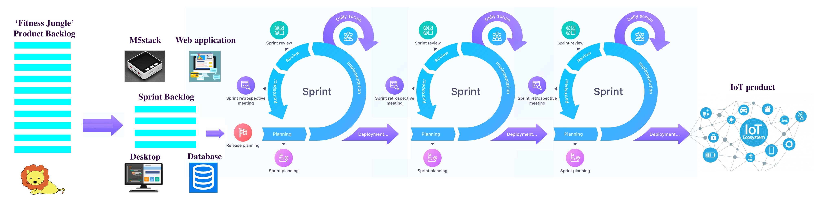
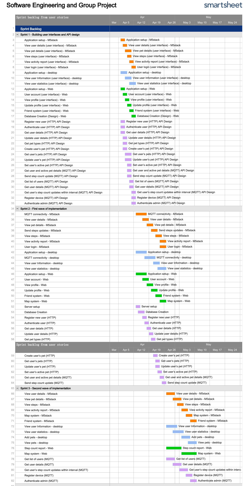

# System Implementation

## Contents of System Implementation
- [**Software Development Lifecycle (SDLC)**](#System-Implementation) 
  - [Waterfall Model](#Waterfall-Model)
  - [Spiral Model](#Spiral-Model)
  - [Agile Model](#Agile-Model)
  - [Choice of SDLC methodology](#Choice-of-SDLC-methodology)
- [**a. Breakdown of project into sprints**](###a.-Breakdown-of-project-into-sprints)
  - [Product Backlog](#M5-Product-Backlog)
  - [Sprint 1: Building user interfaces and API design](#Sprint-1-Building-user-interfaces-and-API-design)
  - [Sprint 2: First wave of implementation](#Sprint-2-First-wave-of-implementation)
  - [Sprint 3: Second wave of implementation](#Sprint-3s-Second-wave-of-implementation)
- [**b. Details of evaluation for designs**](###b.-Details-of-evaluation-for-designs)
  - [Functional Testing](#Functional-testing)
  - [User Interface Design](#Evaluation-of-user-interface-design)
  - [Heuristic Evaluation](#Choice-of-evaluation-technique--Heuristic-Evaluation)
- [**c. Discussion of Social and Ethical implications of the work**](###c.-Discussion-of-Social-and-Ethical-implications-of-the-work)
  - [Society Implications](#Society-Implications)
  - [Informed Consent](#Informed-Consent)
  - [Privacy](#Privacy)
  - [Physical Safety](#Physical-Safety)
  - [Addiction](#Addiction)

## Software Development Lifecycle (SDLC)

With our system design on hand, we are mindful of the importance of a clear software development lifecycle (SDLC) which is the methodology of creating a high-quality software using the shortest time possible. This is accomplished by splitting the project into phases. Some of the most popular SDLC models include the waterfall model, spiral model and Agile model which will be discussed in greater depths in the following sections.

## Waterfall Model

 The idea of a waterfall model was one of the first process model proposed by Winston W. Royce in his paper regarding managing the development of large software system in 1970 [[1]](System_Implementation.md#References). In Royce’s article the term “waterfall” was not used and it was an example for a flawed model, which we will discuss later. 

The waterfall model emphasises the logical progression of phases taken throughout the software development life cycle. It is termed the waterfall due to the nature of the model progression, which is like the cascading steps down an incremental waterfall. This means that the next phase of development only begins only if the previous phase is completed, and do not overlap. The waterfall model gained its popularity due to its simplicity. The sequential phases in waterfall are:

* Requirement gathering and analysis – All the possible requirements of the applications are methodically analysed and documented in a requirement specification document.
* System Design – The requirement specifications are studied, and the system design is prepared. 
* Implementation – The system will be developed into small program called units.
* Integration and testing – The units are then integrated into the system after testing each of the individual units. The entire system will then be tested for faults and failure.
* Deployment – Once the testing is completed, the product is then deployed.
* Maintenance – Patches are released to fix problem as well as the possible enhancement of feature or user interfaces.

<b>
Table 1: Evaluation of waterfall model
</b>
|Advantages|Disadvantages|
|:-:|:-:|
|Simple and easy to understand and use|No working software is produced until late in the cycle|
|Easy to manage|High amount of risk and uncertainty|
|Phases are completed one at a time|Not a good model for complex and especially object oriented one|
|Works well in smaller project|Difficult to measure progress within stages|
|Clearly defined stages| Cannot accommodate changing requirement|
|Easy to arrange task|Adjusting scope during life cycle can end a project|
|Process and result well documented|Delayed testing period|

## Spiral Model

Spiral model is another important SDLC model, which provides support for risk handling. The model was first introduced by Barry Boehm in his 1986 paper, “A Spiral Model of Software Development and Enhancement”, where he used the term “process model” to refer to the spiral model as well as to incremental, waterfall, prototyping, and other approaches, which indicates that it is actually a combination of iterative development process model and sequential linear development model at early stage, but is quite outstanding for its risk-driven feature.

In its diagrammatic representation, spiral model looks like a spiral with many loops, and loop is called a Phase of the process. The accurate number of loops depends on the specific project, where the project managers can define it according to the project risk. 

<b>
Figure 1: The Spiral model graphical representation 
</b>

The Radius of the spiral at any point shows the cost of the project so far, and the angular dimension suggests the progress made so far in the current phase. Each phase begins with a goal for the design, ends when the developer or client reviews the progress and is divided into four quadrants as shown in the diagram. The details of these four quadrants are:

* Determine objectives - Requirements are gathered from the customers and the objectives are identified, elaborated and analyzed at the start of every phase. It is important to also identify alternative solutions in case the attempted version fails to perform.
* Identify and resolve risks - Risk analysis should be performed on all possible solutions in order to find any faults or vulnerabilities during this quadrant-- such as running over the budget or areas within the software that could be open to cyber-attacks. Each risk should then be resolved using the most efficient strategy. At the end of this quadrant, Prototype is built for the best possible solution.
* Development and test - During the third quadrant, the identified features are developed and verified through testing. At the end of the third quadrant, the next version of the software is available.
* Plan the next iteration - In the last quadrant, the test results of the newest version are evaluated. This analysis allows programmers to stop and understand what worked and didn’t work before progressing with a new build. At the end of this quadrant, planning for the next phase begins and the cycle repeats. At the end of the whole spiral, the software is finally deployed in its respective market.

Based on its characteristics, the spiral model is best used in large, expensive and complicated projects. Its pros and cons are discussed below:

<b>
Table 2: Evaluation of spiral model
</b>

|Advantages|Disadvantages|
|:-:|:-:|
|Risk handling|Complex|
|Flexibility - Changes made to the requirements during the process can be easily adopted and incorporated|Too much dependable on Risk Analysis - Without very highly experienced expertise, it is going to be a failure to develop a project using this model.|
|Customer satisfaction - The spiral model facilitates customer feedback|Difficulty in time management - The number of phases is unknown at the start of the project, so time estimation is very difficult.|
|Easy to estimate cost of the whole project| Expensive, not suitable for small projects|

## Agile Model
Agile model is also a type of Incremental model. Software is developed in incremental, rapid cycles. This results in small incremental releases with each release building on previous functionality. Each release is thoroughly tested.

<b>
Figure 2: Graphical representation of sprints 
</b>

Unlike the Waterfall model, the development team ultimately decides at the beginning of a sprint (or iteration) what can be accomplished in the timeframe and sets out to build a series of features, delivering working software that can be installed in a production environment at the end of the sprint, which meets the demand for faster software development.

There are various approaches adhering to Agile, including, but not limited to:
* Scrum
* Crystal
* Dynamic Software Development Method (DSDM)
* Feature Driven Development (FDD)
* Lean Software Development
* Extreme Programming (XP)

<b>
Figure 3: The Agile model graphical representation 
</b>

Importantly, the Agile software development lifecycle is dominated by the iterative process. Each iteration results in the next piece of the software development puzzle. There are different expressions regarding the stages in an iteration process, but most are similar in general. A typical example is as follows:
* Requirements - Define the requirements for the iteration based on the product backlog, sprint backlog, customer and stakeholder feedback.
* Design - When the project has been identified, the team should work with stakeholders to define requirements. Flow diagram or the high-level UML diagram can be used to show the work of new features.
* Development - When the team defines the requirements, the work begins. Designers and developers start working on their project, which aims to deploy a working product. The product will undergo various stages of improvement, so it includes simple, minimal functionality.
* Testing - QA (Quality Assurance) testing, internal and external training, documentation development.
* Deployment - Integrate and deliver the working iteration into production
* Review/Feedback - Accept customer and stakeholder feedback and work it into the requirements of the next iteration.

<b>
Table 3: Evaluation of agile model
</b>
|Advantages|Disadvantages|
|:-:|:-:|
|Frequent Delivery|Lack of emphasis on necessary designing and documentation|
|Face-to-Face Communication with clients|The project can easily get taken off track if the customer representative is not clear what results that they want|
|Efficient design and fulfils the business requirement|Only senior programmers can take the kind of decisions required during the development process|
|Anytime changes are acceptable|In case of some software deliverables, especially the large ones, it is difficult to assess the effort required at the beginning of the software development life cycle|
|Reduce total development time| |
|Continuous attention to technical excellence and good design| |

## Choice of SDLC methodology

By contrasting the different models for software development, we decide to go for the Agile approach for the following few reasons. Firstly, the Agile approach has a few immediate advantages over traditional method such as the waterfall model due to its nature of being flexible. Although the rigidity of the waterfall model does prove to be very efficient in completing task phase by phase, and also the methodology can be explained with ease to ammeter coder there are inherent risk in this approach one of the most obvious being the lack to unit testing. Secondly, due to our idea and features for the project constantly evolving as we are implementing new features, so the Agile model fits our requirement as it features frequent check-ins which allow for changes to be made constantly. Whereas in the waterfall model, due to the linear progression does not encourage phases to be revisited.  Thirdly, the Agile methodology is way faster overall compared to the other methodology because far less re-work or major changes are made when progressing as most issues and changes are identified in the early stages.

## a. Breakdown of project into sprints
As mentioned above in our system implementation we decided on the agile approach which features breaking down of project into sprints. Sprint planning is part of the scrum framework where we will determine what to work on in each of the sprint and discuss the initial plan for completing these backlog items. The figure below is a graphical representation of our sprint cycle and the detailed backlogs items derived from our user stories can be seen at (reference start of backlog) here.

<b>
Figure 4: The agile model for Fitness Jungle 
</b>

### M5 Product Backlog
<b>
Table 4: M5 Product Backlog
</b>

|Priority|Backlog Item|User Story ID|User Story|Estimated time (hours)|
|:-:|:-:|:-:|:-:|:-:|
|1|Application setup|-|-|3|
|2|MQTT connectivity|-|-|8|
|3|View user details|5|As a user, I want to view my details on my device, so that I can identify my device.|15|
|4|View pet details|3|As a user, I want to view my virtual pet details, so that I can see its progress.|26|
|5|View steps|2|As a user, I want to track my steps and calories, so that I can know my daily step count.|12|
|6|View activity report|1|As a user, I want to view my activity report, so that I can better plan my exercise regime.|17|
|7|User login|4|As a user, I want to be able to log in, so that I can access the application.|17|
|8|Send step updates|8|As a user, I want to send my steps to server, so that I can track my steps and calories.|2|
|9|Map system|7|As a user, I want to check the map and track my movement route, so that I can look back and see what I have been today.|18|
|10|Friend system|6|As a user, I want to view and add friends, so that I can interact with my friends.|14|
|11|View health report|9|As a user, I want to receive my health report, so that I can see my sport progress.|15|

### Desktop Product Backlog
<b>
Table 5: Desktop Product Backlog
</b>
|Priority|Backlog Item|User Story ID|User Story|Estimated time (hours)|
|:-:|:-:|:-:|:-:|:-:|
|1|Application setup|-|-|3.5|
|2|MQTT connectivity|-|-|3.5|
|3|View user information|2|As a developer, I want to be able to view information about any user, so I can tailor specific health feedback to them.|22.5|
|4|View user statistics|3|As a developer, I want to be able to view a graphical representation of my user’s usage statistics, so that I can have a better understanding about the user’s usage.|17.5|
|5|Add pets|4|As a developer, I want to be able to add new virtual pets and pet skins, so that the users will have a variety to pet and pet skins to choose from.|15|
|6|View pets|6|As a developer, I want to be able to view virtual pets and pet skins, so that I can see the list currently available to the users.|1|
|7|Modify pets|5|As a developer, I want to be able to modify virtual pets and pet skins, so that I can make updates to the designs.|15|
|8|Admin authentication|1|As a developer, I want to be able to log in to the application, so that I can be authenticated to view privileged information about my users.|15|
|9|Logging System|7|As a developer, I want to be able to view all the changes made on the desktop application, so that I can revert to previous state if a bug was produced.|20|

### Web Product Backlog 
<b>
Table 6: Web Product Backlog 
</b>
|Priority|Backlog Item|User Story ID|User Story|Estimated time (hours)|
|:-:|:-:|:-:|:-:|:-:|
|1|Application setup|-|-|5|
|2|User account|1|As a user, I want to register an account, log in and link my M5Stack to it, so that I can start playing the game.|10|
|3|View profiles|2|As a user, I want to view my profile and pet information, so that I can identify my account and view my pet’s progress.|8|
|4|Update profile|4|As a user, I want to edit my profile and pet status, so that I can make changes should I want to.|10|
|5|Friend system|5|As a user, I want to view my friends list, so that I can interact with my friends.|12|
|6|Step count report|3|As a user, I want to view a report about my daily steps, so that I can monitor my daily activity.|10|
|7|Map system|6|As a user, I want to check my daily route on the map, so that I can look back at and see where I have been today.|18|

### Server Product Backlog
<b>
Table 7: Server Product Backlog 
</b>
|Priority|Backlog Item|For sub-system|User Story ID|Estimated time (hours)|
|:-:|:-:|:-:|:-:|:-:|
|1|Server setup|-|-|3|
|2|Database Creation|-|-|22|
|3|Register new user (HTTP)|Web|1|5|
|4|Authenticate user (HTTP)|Web|1|5|
|5|Get user details (HTTP)|Web|2|5|
|6|Update user details (HTTP)|Web|4|5|
|7|Get pet types (HTTP)|Web|4|5|
|8|Create user’s pet (HTTP)|Web|4|5|
|9|Get user’s pets (HTTP)|Web|2|5|
|10|Update user’s pet (HTTP)|Web|4|5|
|11|Set user’s active pet (HTTP)|Web|4|5|
|12|Get user and active pet details (MQTT)|M5stack|5|5|
|13|Send step count update (MQTT)|M5stack|3|5|
|14|Get list of users (MQTT)|Desktop|2|5|
|15|Get user details (MQTT)|Desktop|2|5|
|16|Get user’s step count updates within|Desktop|-|5|
|17|Register device (MQTT)|M5stack|3|5|
|18|Authenticate admin (MQTT)|Desktop|4|5|

### Sprint 1-Building user interfaces and API design

In this sprint, we will not be building the full features but rather just the user interfaces. This is a little unconventional since a sprint cycle usually takes a feature through design to implementation. However, the team felt that it will be more beneficial if we started with the building of the user interfaces to make clear of the data requirements and allow a more coherent flow of the applications. This will also allow for a better API design as the API designer will have an overview of the data required by the different clients and be able to build more general-purpose APIs that can be shared by clients. This contrasts with building APIs with each feature implementation, which can result in APIs with narrow scopes and increase data redundancy in APIs. In addition, making any API changes will result in previous implemented features having to be modified to keep with the changes. Thus, to reduce API changes and have a better application design flow, the team decided to take an unconventional approach in the first sprint. 

At this stage, the meetings are held every 2 days instead of daily as advocated in Scrum. This is due to the reason that more time is required for coming up with designs before holding meetings. An end of sprint meeting is held to discuss about the sprint that just happened, and to identify the areas we did well and the areas to improve. In particular, the team felt that the meetings held every other day are great in keeping everyone on the same page. However, we felt that the communication of requirements is not as active as we will like and will work on it for subsequent sprints. We also reviewed and confirmed on the design details and decided on details for the next sprint.

#### M5Stack Sprint 1 Backlog
<b>
Table 8: M5Stack Sprint 1 Backlog
</b>
Priority|Product Backlog Item|User Story ID|Estimated time (hours)
|:-:|:-:|:-:|:-:|
|1|<b>Application setup|-|3
| |Setup M5Stack environment and import relevant modules| |3
|2|<b>View user details (user interface)|5|6
| |Designing user details page| |3
| |Creating user details page| |3
|3|<b>View pet details (user interface)|3|10
| |Designing pet details page| |5
| |Creating pet details page| |5
|4|<b>View steps (user interface)|2|4
| |Designing track steps page| |2
| |Creating track steps page| |2
|5|<b>View activity report (user interface)|1|6
| |Designing report page| |2
| |Creating report page| |4
|6|<b>User login (user interface)|4|9
| |Designing logo page| |1.5
| |Creating logo page| |1.5
| |Designing login page| |1.5
| |Creating login page| |1.5
| |Designing keyboard plug-in unit| |1.5
| |Creating keyboard plug-in unit| |1.5

#### Desktop Sprint 1 Backlog
<b>
Table 9: Desktop Sprint 1 Backlog
</b>
Priority|Product Backlog Item|User Story ID|Estimated time (hours)
|:-:|:-:|:-:|:-:|
|1|<b>Application setup|-|2.5
| |Create a setup method for the processing window| |1
| |Create a draw method for setting background of window| |1
| |Create a dashboard class for the methods such as building of display elements| |0.5
|2|<b>View user Information (user interface)|2|4
| |Create an element that loads picture from web, resize image and appropriately displaying image at a suitable position| |0.5
| |Create an element that display user information such as username, first name, etc. (Static information)| |0.5
| |Create a dropdown list to display all the different user registered in the database| |2
|3|<b>View user statistics (user interface)|3|3.5
| |Create an element that display user basic statistic such as daily steps, weekly steps and average daily steps (Static information)| |0.5
| |Create an element that plot bar chart for daily steps by hourly basis and weekly steps daily basis (Static information)| |3

#### Web Sprint 1 Backlog
<b>
Table 10: Web Sprint 1 Backlog
</b>
Priority|Product Backlog Item|User Story ID|Estimated time (hours)
|:-:|:-:|:-:|:-:|
|1|<b>Application setup|-|2
| |Setup Vue.js and import relevant libraries| |2
|2|<b>User account (user interface)| 1|4
| |Log in page framework| | 2
| |Log in page CSS| | 2
|3|<b>View profile (user interface)| 2| 4
| |Profile page framework| | 2
| |Profile page CSS| | 2
|4|<b>Update profile (user interface)|4|4
| |Profile edit page framework| | 2
| |Profile edit page CSS| | 2
|5|<b>Friend system (user interface)| 5| 6
| |Friend component| | 2
| |Friend component CSS| | 2
| |Friend list page| |1
| |Friend list page CSS| | 1
|6|<b>Map system (user interface)| 6|2
| |Map page framework| | 1
| |Map page CSS| |1

#### Server Sprint 1 Backlog
<b>
Table 11: Server Sprint 1 Backlog
</b>
Priority|Product Backlog Item|For sub-system|User Story ID|Estimated time (hours)
|:-:|:-:|:-:|:-:|:-:|
|1|<b>Database Creation (Design)|-|-|10
||Design User table||1
||Design BasePetType table||1
||Design PetType table||1
||Design PetLevel table||1
||Design UserPet table||1
||Design UserIntervalStep table||1
||Design UserPetIntervalStep table||1
||Design Friend table||1
||Design FriendStatus table||1
||Design Admin table||1
|2|<b>Register new user (HTTP) API Design|Web|1|1
|3|<b>Authenticate user (HTTP) API Design|Web|1|1
|4|<b>Get user details (HTTP) API Design|Web|2|1
|5|<b>Update user details (HTTP) API Design|Web|4|1
|6|<b>Get pet types (HTTP) API Design|Web|4|1
|7|<b>Create user’s pet (HTTP) API Design|Web|4|1
|8|<b>Get user’s pets (HTTP) API Design|Web|2|1
|9|<b>Update user’s pet (HTTP) API Design|Web|4|1
|10|<b>Set user’s active pet (HTTP) API Design|Web|4|1
|11|<b>Get user and active pet details (MQTT) API Design|M5Stack|5|1
|12|<b>Send step count update (MQTT) API Design|M5Stack|3|1
|13|<b>Get list of users (MQTT) API Design|Desktop|2|1
|14|<b>Get user details (MQTT) API Design|Desktop|2|1
|15|<b>Get user’s step count updates within interval (MQTT) API Design|Desktop|3|1
|16|<b>Register device (MQTT) API Design|M5Stack|4|1
|17|<b>Authenticate admin (MQTT) API Design|Desktop|1|1

### Sprint 2-First wave of implementation

In this sprint, we start off the first wave of feature implementations. The server is added with the APIs required by the different sub-systems, developing in the sequence shown in the user sequence diagram. The different sub-systems build on from the user interfaces and establish communication with the server via API calls to retrieve the required data. In particular, for the desktop application, the time required to build the user interfaces exceed the initial expectations in the previous sprint and thus a portion of this sprint will be to continue building the user interfaces alongside implementing features.

At this stage, meetings are held daily as the pace of implementation has picked up and communication between server and the different sub-systems is vital to keep each other up to date. An end of sprint meeting is held to discuss on the current sprint and what could be improved for the implemented features. The improvements to make will be brought over to the next sprint alongside implementation of other features.

#### M5Stack Sprint 2 Backlog
<b>
Table 12: M5Stack Sprint 2 Backlog
</b>
Priority|Product Backlog Item|User Story ID|Estimated time (hours)|
|:-:|:-:|:-:|:-:|
|1|<b>MQTT connectivity</b>|-|8|
| |Setup MQTT environment||1|
| |Setup WiFi class on M5stack| |3|
| |Setup publish and subscribe topics| |1|
| |Test sending messages| |1.5|
| |Test receiving messages| |1.5|
|2|<b>View user details</b>|5|6|
| |Send request JSON| |1|
| |Receive response JSON| |1|
| |Display user details| |4|
|3|<b>View pet details</b>|3|6|
| |Send request JSON| |1|
| |Receive response JSON| |1|
| |Display pet details| |4|
|4|<b>Send steps updates</b>|8|2|
| |Send request JSON| |1|
| |Receive response JSON| |1|
|5|<b>View steps</b>|2|5|
| |Send request JSON| |1|
| |Receive response JSON| |1|
| |Display steps| |3|
|6|<b>View activity report</b>|1|8|
| |Send request JSON| |1|
| |Receive response JSON| |1|
| |Display activity report| |6|
|7|<b>User login</b>|4|8|
| |Send request JSON| |1|
| |Receive response JSON| |1|
| |Display login workflow| |6|

#### Desktop Sprint2 Backlog
<b>
Table 13: Desktop Sprint2 Backlog
</b>
Priority|Product Backlog Item|User Story ID|Estimated time (hours)
|:-:|:-:|:-:|:-:|
1|<b>Application setup|-|1
| |Create a local database to store data required locally| |1
2|<b>MQTT connectivity|-|3.5
| |Create a way to prints the connection status to the broker. E.g. connected, disconnected| |0.5
| |Create a method that handle incoming messages from the broker. E.g. updating user's information, etc.| |3
3|<b>View user Information|2|17
| |Create a dropdown list to display all the different user registered in the database (revisited)| |2
| |Create a class containing all the API for getting information on the list of users as well as performing data manipulation.| |5
| |Create a class containing all the API for performing specific user related tasks.| |5
| |Display the user information| |5
4|<b>sView user statistics|3|13
| |Create a class containing all the API to perform task related to the manipulation of data for steps.| |5
| |Display the graphs| |8

#### Web Sprint2 Backlog
<b>
Table 14: Web Sprint 2 Backlog
</b>

Priority|Product Backlog Item|User Story ID|Estimated time (hours)
|:-:|:-:|:-:|:-:|
1|<b>Application setup|-|3
| |Router component registration| |1
| |Router anchors registration| |2
2|<b>User account|1|6
| |Log in page state design| |2
| |Function of update state by post request to server| |4
3|<b>View profile| 2|4
| |Profile page state design| |2
| |Function of update state by post request to server| |2
4|<b>Update profile| 4|6
| |Update profile state design| |2
| |Function of update state by post request to server| |4
5|<b>Friend system|5|6
| |Friend component state design| |1
| |Friend list page state design| |1
| |State delivery between friend component and friend list page| |2
| |Function of update state by post request to server| |2
6|<b>Map system| 6|6
| |Map page framework| |3
| |Function of update state by post request to server| |3

#### Server Sprint 2 Backlog
<b>
Table 15: Server Sprint 2 Backlog
</b>
Priority|Product Backlog Item|For sub-system|User Story ID|Estimated time (hours) 
|:-:|:-:|:-:|:-:|:-:|
1|<b>Server setup|-|-|3
||Create a Node.js server|||3
2|<b>Database Creation|-|-|12
||Create and connect to sqlite3 database|||2
||Create User table|||1
||Create BasePetType table|||1
||Create PetType table|||1
||Create PetLevel table|||1
||Create UserPet table|||1
||Create UserIntervalStep table|||1
||Create UserPetIntervalStep table|||1
||Create Friend table|||1
||Create FriendStatus table|||1
||Create Admin table|||1
3|<b>Register new user (HTTP)|Web|1|4
||Build API|||2
||Test API|||2
4|<b>Authenticate user (HTTP)|Web|1|4
||Build API|||2
||Test API|||2
5|<b>Get user details (HTTP)|Web|2|4
||Build API|||2
||Test API|||2
6|<b>Update user details (HTTP)|Web|4|4
||Build API|||2
||Test API|||2
7|<b>Get pet types (HTTP)|Web|4|4
||Build API|||2
||Test API|||2
8|<b>Create user’s pet (HTTP)|Web|4|4
||Build API|||2
||Test API|||2
9|<b>Get user’s pets (HTTP)|Web|2|4
||Build API|||2
||Test API|||2
10|<b>Update user’s pet (HTTP)|Web|4|4
||Build API|||2
||Test API|||2
11|<b>Set user’s active pet (HTTP)|Web|4|4
||Build API|||2
||Test API|||2
12|<b>Get user and active pet details (MQTT)|M5Stack|5|4
||Build API|||2
||Test API|||2
13|<b>Send step count update (MQTT)|M5Stack|3|4
||Build API|||2
||Test API|||2

### Sprint 3-Second wave of implementation

Coming to the second wave of implementation and the final sprint, the first part of this sprint will be to make improvements on the features implemented in Sprint 2 as discussed in the previous end of sprint meeting. Then it is to continue to work on the new features that are decided upon. Throughout the sprints, system testing is carried out with the implementation of each new feature to ensure the previous features are still working as intended with the addition of the new feature. The last part of the sprint, although not specified in the sprint backlog, is a full system testing where the 3 sub-systems are integrated and combined. Each group will test their sub-system and well as the other sub-systems to ensure functionalities of the system work as intended. Each group provides a checklist of use cases to the other groups to facilitate the testing. An end of sprint meeting is held to conclude on the development of the system, and to highlights any bugs that still exist. Bug fixes will be carried out and resolved before requesting for other groups to test the system again.

#### M5Stack Sprint 3 Backlog
<b>
Table 16: M5Stack Sprint 3 Backlog
</b>
Priority|Product Backlog Item|User Story ID|Estimated time (hours)
|:-:|:-:|:-:|:-:|
1|<b>View user details |5|3
| |Renovate and improve the user view interface| |3
2|<b>View pet details |3|6
| |Renovate and improve the pet view interface| |3
| |Renovate and improve the pet skin view interface| |3
3|<b>View steps|2|3
| |Renovate and improve the steps view interface| |3
4|<b>View activity report|1|3
| |Renovate and improve the report view interface| |3
5|<b>Map system|7|18
| |Designing map details page| |6
| |Creating map details page| |8
| |Add location| |2
| |Add distance| |2
6|<b>Friend system|6|14
| |Designing friend details page| |4
| |Creating friend details page| |4
| |Add friend| |2
| |Add friend| |2
| |Set rank| |2

#### Desktop Sprint 3 Backlog

<b>
Table 17: M5Stack Sprint 3 Backlog
</b>

Priority|Product Backlog Item|User Story ID|Estimated time (hours)
|:-:|:-:|:-:|:-:|
1|<b>View user Information|2|1.5
| |Adjusting the position of text box, font size to ensure user information is displayed correctly| |0.5
| |Adjusting the position of text box, font size to ensure user information is displayed correctly| |0.5
| |Adjusting the position of dropdown list| |0.5
2|<b>View user statistics|3|1
| |Adjusting the position of daily and weekly bar chart| |1
3|<b>Add pets|4|15
| |Create an interface for the adding of pets| |8
| |Create a class containing all the API required for the management of pets.| |5
| |Display add pet workflow| |2
4|<b>View pets|6|15
| |Create an interface for the viewing of pets| |10
| |Display the pet details| |5

#### Web Sprint 3 Backlog

<b>
Table 18: Web Sprint 3 Backlog
</b>

Priority|Product Backlog Item|User Story ID|Estimated time (hours)
|:-:|:-:|:-:|:-:|
1|<b>Step count report|2|10
| |Import EChart plugin| |2
| |Render EChart using data from server| |8
2|<b>Map system|6|10
| |Import map plugin| |2
| |Render map using data from server| |8

#### Server Sprint 3 Backlog
<b>
Table 19: Server Sprint 3 Backlog
</b>
Priority|Product Backlog Item|For sub-system|User Story ID|Estimated time (hours)
|:-:|:-:|:-:|:-:|:-:|
1|<b>Get list of users (MQTT)|Desktop|2|4
| |Build API| | |2
| |Test API| | |2
2|<b>Get user details (MQTT)|Desktop|2|4
| |Build API| | |2
| |Test API| | |2
3|<b>Get user’s step count updates within interval (MQTT)|Desktop|3|4
| |Build API| | |2
| |Test API| | |2
4|<b>Register device (MQTT)|M5Stack|4|4
| |Build API| | |2
| |Test API| | |2
5|<b>Authenticate admin (MQTT)|Desktop|1|4
| |Build API| | |2
| |Test API| | |2

The next two figures are backlog in the Gantt chart and Trello we used in sprints:

<b>
Figure 5: The Gantt chart of sprints 
</b>

<b>
Figure 6: The sprints in Trello 
</b>

## b. Details of evaluation for designs

The two groups of design under evaluation will be the system design, as discussed in the previous section, and the user interface design. 

### Objective
The system design will be evaluated based on the ability to meet system requirements using the design and the extensibility of the project. The team decided on this objective as it is a proof-of-concept project and the most important aspect of the project is to allow end users to try out the functionalities of the system. To determine if the system requirements are met, we start by performing software testing.

### Functional testing

The approach to software testing will be the “box” approach, specifically black-box testing or functional testing [[6]](System_Implementation.md#References). This method is chosen since the focus of the testing will be to make sure that the functionalities of the system, as specified in the system requirements, work as intended. In addition, the functional testing technique used is use case testing where the system is tested against a list of test cases [[6]](System_Implementation.md#References). The list of test cases is drafted based on the system requirements. The other techniques such as boundary value analysis and error guessing [[6]](System_Implementation.md#References) are not employed, since at the proof-of-concept stage we are most concerned with usability of the system and less emphasis is put on edge case testing.

Thus, for each of the sub-systems, the first step will be to draft the list of use cases for each feature. Once that is completed, development will take place and the testing of each feature will be checking each of the use cases. If any of the use cases are not satisfied, the development continues until each of use cases are checked. When the entire list is checked, the feature will be ready for system testing where the feature will be tested with the rest of the system.

 As for the server, the APIs provided are tested according to the requirement specifications given by the three sub-system clients. To ensure that the data returned to the various clients is as intended, the first step to the development workflow will be to gather the data requirements from the various clients. After gathering the requirements, the API request and response objects will be designed and communicated to the sub-system clients for approval. This forms the first level of evaluation. After confirmation of the API design, the development of APIs will begin. HTTP APIs will be tested using a testing software called “Postman”. Postman allows sending of RESTful HTTP requests easily, therefore the APIs can be tested and verified with different requests and responses. As for MQTT APIs, the testing of these APIs will require an initial setup on the MQTT broker and examining the results on the broker.

### System Testing
Succeeding the functional testing will be system testing, where each feature of the sub-system will be integrated with the rest of the sub-system and tested [[6]](System_Implementation.md#References). This is one of the techniques in white-box testing, alongside unit testing and integration testing [[6]](System_Implementation.m#References). The other techniques are once again not employed due to the focus on producing functionalities for the system for proof-of-concept. In terms of code management, each sub-system has a branch manager that manages the merging of feature branches. After a member completes a feature and posts on a feature branch, the member will do a pull request to the main branch (more details of code and branch management in section 3c). The branch manager then conducts system testing to ensure that the feature branch works with the rest of the sub-system. Following that, the feature will be merged and posted on the main branch of the sub-system and members from other sub-systems will perform system testing.

### Limitations of testing techniques

After justifying the chosen techniques for testing, it is also important to state the limitations of these techniques. As mentioned earlier, there are other techniques in functional testing such as boundary value analysis and error guessing. The limitation of use case testing will be that we are not testing for edge cases with user input or action that can cause errors in the system. The system may be prone to errors with unexpected inputs or actions. These are bugs that are caused by unexpected user behaviour.

Next, for system bugs caused by the mistakes of programmers, functional testing is not comprehensive in detecting this type of bugs. System testing also only tests if the functionalities are working after integration using the expected user workflow. These tests do not test each section of the written program to ensure each section of the code is working as intended. The tests we employed are tests on the functionalities of the system on a higher level. The testing techniques that are aimed at mitigating such bugs are the unit test and integration test of the white-box testing. These tests are written for each section of the code written to ensure each unit of the code works as intended.

### Extensibility of system
After making sure system requirements are met, we can then evaluate the system design based on the extensibility of the project after implementing the design. The way we evaluate this is by firstly going through the list of features we have yet to implement and the foreseeable future enhancements and determining whether we can easily add these features to the system. According to the list, 
We can also easily substitute any part of the system

This fulfills the principle of “Separation-of-Concerns" (SoC) as the data is stored in a separate repository and we can modify the codebase of each sub-system without affecting dependencies. The principles of least surprise and least effort are also fulfilled since we are not introducing another database server and reducing setup overhead by using an embedded database. 

A standardised JSON object format is used for MQTT communication to ensure that subscribers on the same topic will be able to distinguish the sender and recipient as well as the API call. Details of the API design will be discussed under section 1e. This fulfills the “Liskov Substitution Principle” where the standardised request and response JSON objects serve as a common “contract” between the different sub-systems, which allows for substitution of the sub-systems. Lastly, the database is designed considering the foreseeable enhancements and normalised to BCNF form. This fulfills the “Open-Closed” principle where we allow for functional extensions to the various sub-systems.

## Evaluation of user interface design
### Objective
The main goal of the evaluation is essentially testing the usability of the UI system, including ease of operation, interaction efficiency, the frequency and severity of the error and user satisfaction. The type of testing done in this case will be user testing where the UI designs are tested with real users in real scenarios. The objective of the test is to have a better understanding of user concerns regarding the usability of the product. 

### User testing techniques

The following are commonly used user testing techniques: 
* Heuristic Evaluation - This method involves evaluators examining the interface and judging its compliance with recognized usability principles (the "heuristics").
* Cognitive Walkthrough - The cognitive walkthrough method is a usability inspection method used to identify usability issues in interactive systems, focusing on how easy it is for new users to accomplish tasks with the system.This method involves evaluators examining the interface and judging its compliance with recognized usability principles (the "heuristics").
* Structured and Unstructured Interview - Structured and unstructured interviews are common methods of gathering data in research. While structured interviews are mostly used in quantitative observation, an unstructured interview is usually used in qualitative data collection. - The cognitive walkthrough method is a usability inspection method used to identify usability issues in interactive systems, focusing on how easy it is for new users to accomplish tasks with the system.
* GOMS (Goals, Operators, Methods and Selection Rules) - A GOMS model is composed of methods that are used to achieve specific goals. These methods are then composed of operators at the lowest level. The operators are specific steps that a user performs and are assigned a specific execution time. 

### Choice of evaluation technique--Heuristic Evaluation

Beside the realistic factors, Heuristic Evaluation itself is a very useful method which has been proved to be efficient and strong enough for software UI design. It is a detailed, technically sound process that assesses the product against a clear set of criteria. In addition, due to current situation of the COVID-19, it’s rather impractical for us to conduct off-line user research. Thus, the team decided that Heuristic Evaluation would be the most practical UI evaluation method for us. 

The ten principles of Heuristic Evaluation are as follow:
1. Visibility of system status
2. Match between system and the real world
3. User control and freedom
4. Consistency and standards
5. Error prevention
6. Recognition rather than recall
7. Flexibility and efficiency of use
8. Aesthetic and minimalist design
9. Help users recognize, diagnose, and recover from errors
10. Help and documentation 

We made a questionnaire following the principles of Heuristic Evaluation for our group members who are responsible for the different sub-systems. From completing the questionnaire, it turns out that the advantages and disadvantages of our UI design are highlighted quickly and clearly.

The evaluation is only as good as the people we get to do it. This means we have to spend a lot of time analysing and reviewing experts to make sure they are relevant and experienced in the issues you are concerned with.

<b>
Figure 7: Heuristic Evaluation of Fitness Jungle 
</b>

### Limitations of Heuristic Evaluation
* The groups developing each sub-system are small, therefore the range of views is narrow
* As the evaluation is done by the developers of the system, it may not reflect the actual needs of the users.
* The team does not consist of an expert on user experience design, thus it may not be the most accurate evaluation of design

## c. Discussion of Social and Ethical implications of the work
From the planning stages of our project, fitness jungle we always had the goal of releasing this product to the public. With our product spanning multiple platform such as web application, desktop and IoT in the form of M5Stack we took all the necessary precautions when dealing with data as well as accruing appropriate consent from the users. To adhere with all the possible guidelines, we follow the BCS Code of Conduct, and we are aware of the implications on public health, privacy, security and wellbeing of others and the environment.  We also have due regard for the legitimate rights of third parties; we will conduct our professional activities without discrimination on the grounds of sex, sexual orientation, marital status, nationality, color, race, ethnic origin, religion, age or disability, or of any other condition or requirement; we will promote equal access to the benefits of IT and seek to promote the inclusion of all sectors in society wherever opportunities arise[[7](System_Implementation.md#References)].

We will be focusing on addressing the social implications, consent, physical and mental wellbeing as well as privacy and security in the next few paragraphs.  

### Society Implications
Our goal for Fitness Jungle is to improve encourage our user to lead a heathier lifestyle through the synergy of a built-in pedometer with interesting virtual pets. Similar sports devices on the market provides feedback on the user activity level in the form of simple statistical information and charts. In our product we made use of cute virtual pet and interesting elements such as challenges, able to progress in terms of pet level and different skin in place of the traditional dull data to motivate users to keep fit. The main social implications are providing the end user with sort of a virtual fitness instructor to keep user motivated as well as the competition between different user. 

### Informed Consent 
Any participants involved in the evaluation are required to understand the information sheet and complete the informed consent referred from the University of Bristol. In the information sheet will introduce the purpose and principle of our work, our main target audience, risks and implications, as well as access to our feedback channel. Participants will then be asked to complete the informed consent if they are still willing to take part in the evaluation and they are of required age for legal consent. The end-user also needs to read the information sheet and agree with the informed consent before registering as an official user or the first time using our product in order to gain the permission of its users.   

### Privacy  
This IoT device will gather personal information and physical health data through the web application and M5 stack, and communicate with the other key sub-system using MQTT as mentioned in our communication protocol. Personal information are generally collected upon users registration on the web application, the steps taken along with date and time are automatically updated on a specific time period. These data collected will be store mainly on our embedded database within our web application back-end server. The other key sub system such as the desktop application has no long-term storage of these data and only request data from the server when required and destroyed upon changing screens or exiting the application. To protect user’s privacy, this work is consciously regulated under the EU General Data Protection Regulation (GDPR)[[8]](System_Implementation.md#References), which has confirmed in the UK in 2018.  

### Information Security 
We guarantee that the data collected will be used solely for this product and will not be shared with other platforms or corporation for momentary gains, however we cannot ensure effective information delivery due to unencrypted informational flow and possible security leaks by hacker. For example, during the testing of communication with the different subsystems, messages in the form of JSON object will be exposed with access to the topic subscription title.. In addition, the originally planned map system may cause greater security risk in terms of location privacy, which is mainly why the map feature was not implemented. The map feature will upload geographical location of users in real time, causing serious privacy implication such as current user location to malicious attacks.  

### Physical Safety 
With our planned introduction of challenges and competitions, there may be increased pressure for users to want to do well. With the eagerness to make some steps more quickly, there can be an increased risk to falling down and hitting into obstacles. In addition, the user may pay more attention on the M5Stack device than looking at the road. We will look to mitigate this by alerting the user to look at the road if we detect that the user has been looking at the M5Stack too frequently.  

### Addiction 
Like with any games, there is a risk of user addiction. If the users really like the game and wants to spend long hours to achieve better results in the game, it can affect their other aspects of life. This may have an impact on their careers or their studies as they will be spending less time on them. In addition, an addiction can be detrimental for the mental health. However, the user may not realise spending too much time on the app unless it is too late. It is therefore important that we send reminders to the users to alert them about the time spent on the app to help them notice this. 

### References
[[1] W. W. Royce. 1987. Managing the development of large software systems: concepts and techniques](http://www-scf.usc.edu/~csci201/lectures/Lecture11/royce1970.pdf)

[[2]Spiral Model](https://pdfs.semanticscholar.org/3d71/0cdac84dce7387177da471b9822e03029d1c.pdf?_ga=2.68442905.987963553.1590128111-1603561370.1589100842)

[[3]Sprint](http://www.seherfranz.com/story.html)

[[4]Agile model](https://www.smashingmagazine.com/2020/04/collaborative-coding-ultimate-career-hack/)

[[5] MANAGING THE DEVELOPMENT OF LARGE SOFTWARE SYSTEMS](http://www-scf.usc.edu/~csci201/lectures/Lecture11/royce1970.pdf)

[[6] Limaye, M.G. (2009). Software Testing Tata McGraw-Hill Education. pp. 108–11. ISBN 9780070139909](https://www.worldcat.org/title/software-testing-principles-techniques-and-tools/oclc/773796642)

[[7]BCS,the BCS Code of Conduct](https://www.bcs.org/membership/become-a-member/bcs-code-of-conduct/)

[[8]The EU General Data Protection Regulation(GDPR)](https://ttps://gdpr-info.eu/)